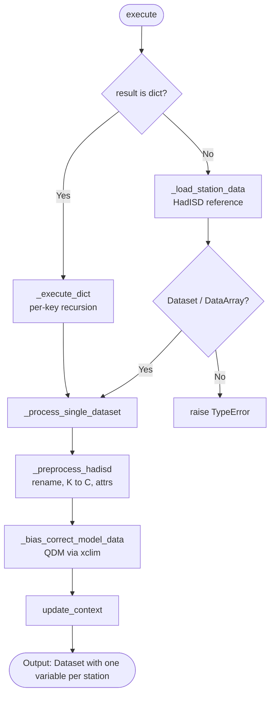

# Processor: BiasAdjustModelToStation

**Registry key:** `bias_adjust_model_to_station` &nbsp;|&nbsp; **Priority:** 60 &nbsp;|&nbsp; **Category:** Data Refinement

Apply quantile delta mapping (QDM) bias correction to gridded climate model data using HadISD weather station observations as the training reference. Output is bias-corrected at the requested station locations, with one data variable per station.

## Algorithm



## Parameters

The processor takes a **dict**:

| Key | Type | Default | Description |
|-----|------|---------|-------------|
| `stations` | `list[str]` | `[]` | Station names to bias-correct against. Required for non-trivial use. |
| `historical_slice` | `tuple[int, int]` | `(1980, 2014)` | Years used as the training period. |
| `window` | `int` | `90` | Window size (days) for seasonal grouping in QDM. |
| `nquantiles` | `int` | `20` | Number of quantiles for the QDM mapping. |
| `group` | `str` | `"time.dayofyear"` | Temporal grouping passed to `xclim` QDM. |
| `kind` | `str` | `"+"` | Adjustment kind: `"+"` (additive) or `"*"` (multiplicative). |

## Requirements

- **Activity ID**: WRF (dynamical downscaling). LOCA2 already includes statistical bias correction at the watershed level and is not the intended input.
- **Variable**: Designed for hourly temperature (`t2`); the underlying station observations are HadISD temperature.
- **Time coverage**: Input must include the historical training period (default 1980–2014). HadISD reference data is available through 2014‑08‑31.
- **Calendar**: All inputs are converted to a `noleap` calendar internally for consistency.

## Example

```python
from climakitae.new_core.user_interface import ClimateData

data = (ClimateData()
    .catalog("cadcat")
    .activity_id("WRF")
    .institution_id("UCLA")
    .variable("t2")
    .table_id("1hr")
    .grid_label("d03")
    .processes({
        "time_slice": ("1980-01-01", "2050-12-31"),
        "bias_adjust_model_to_station": {"stations": ["KSAC", "KSFO"]},
    })
    .get())

# Result: one data variable per station, time-sliced to requested range.
```

## Code References

| Method | Lines | Purpose |
|--------|-------|---------|
| `__init__` | [148–183](https://github.com/cal-adapt/climakitae/blob/main/climakitae/new_core/processors/bias_adjust_model_to_station.py#L148) | Read configuration dict with defaults |
| `_preprocess_hadisd` | [185–241](https://github.com/cal-adapt/climakitae/blob/main/climakitae/new_core/processors/bias_adjust_model_to_station.py#L185) | Rename / unit-convert / attribute the raw HadISD slice |
| `_load_station_data` | [243–307](https://github.com/cal-adapt/climakitae/blob/main/climakitae/new_core/processors/bias_adjust_model_to_station.py#L243) | Resolve station IDs, load HadISD subset, return reference Dataset |
| `_bias_correct_model_data` | [309–508](https://github.com/cal-adapt/climakitae/blob/main/climakitae/new_core/processors/bias_adjust_model_to_station.py#L309) | Build QDM (`xclim`) train/adjust per station |
| `_process_single_dataset` | [510–721](https://github.com/cal-adapt/climakitae/blob/main/climakitae/new_core/processors/bias_adjust_model_to_station.py#L510) | Load reference, run QDM via `xarray.map`, return per-station vars |
| `_execute_dict` | [723–788](https://github.com/cal-adapt/climakitae/blob/main/climakitae/new_core/processors/bias_adjust_model_to_station.py#L723) | Recursive dict path |
| `execute` | [790–862](https://github.com/cal-adapt/climakitae/blob/main/climakitae/new_core/processors/bias_adjust_model_to_station.py#L790) | Dispatcher: dict / Dataset / DataArray |
| `update_context` | [864–891](https://github.com/cal-adapt/climakitae/blob/main/climakitae/new_core/processors/bias_adjust_model_to_station.py#L864) | Record stations and QDM parameters in `new_attrs` |
| `set_data_accessor` | [893–](https://github.com/cal-adapt/climakitae/blob/main/climakitae/new_core/processors/bias_adjust_model_to_station.py#L893) | Receive `DataCatalog` reference (used by `_load_station_data`) |

> Earlier docs implied an early "activity_id == WRF" guard with line numbers in the 80–145 range. Those line numbers do not exist in the source — the file's first method (`__init__`) starts at line 148. The activity-id constraint is enforced by data availability rather than an explicit early-return check.

## See also

- [Processor index](index.md)
- [`climakitae/new_core/processors/bias_adjust_model_to_station.py`](https://github.com/cal-adapt/climakitae/blob/main/climakitae/new_core/processors/bias_adjust_model_to_station.py)
- [How-To: bias correction](../howto/bias-correction.md)
