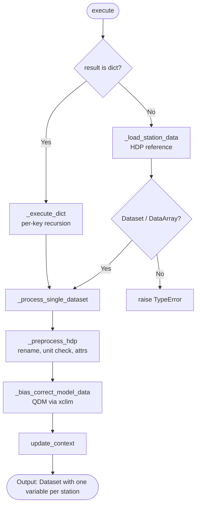

# Processor: BiasAdjustModelToStation

**Registry key:** `bias_adjust_model_to_station` &nbsp;|&nbsp; **Priority:** 60 &nbsp;|&nbsp; **Category:** Data Refinement

Apply quantile delta mapping (QDM) bias correction to gridded climate model data using HDP (Historical Data Platform) weather station observations as the training reference. Output is bias-corrected at the requested station locations, with one data variable per station.

## Algorithm


```mermaid
flowchart TD
    Start([execute]) --> DictCheck{result is dict?}
    DictCheck -->|Yes| ExecDict[_execute_dict<br/>per-key recursion]
    DictCheck -->|No| LoadObs[_load_station_data<br/>HDP reference]
    LoadObs --> TypeCheck{Dataset / DataArray?}
    TypeCheck -->|Yes| ProcSingle[_process_single_dataset]
    TypeCheck -->|No| TypeErr[raise TypeError]

    ExecDict --> ProcSingle
    ProcSingle --> Preproc[_preprocess_hdp<br/>rename, unit check, attrs]
    Preproc --> BiasCorrect[_bias_correct_model_data<br/>QDM via xclim]
    BiasCorrect --> UpdateCtx[update_context]
    UpdateCtx --> End([Output: Dataset with one variable per station])

    click Start "https://github.com/cal-adapt/climakitae/blob/main/climakitae/new_core/processors/bias_adjust_model_to_station.py" "execute"
    click ExecDict "https://github.com/cal-adapt/climakitae/blob/main/climakitae/new_core/processors/bias_adjust_model_to_station.py" "_execute_dict"
    click LoadObs "https://github.com/cal-adapt/climakitae/blob/main/climakitae/new_core/processors/bias_adjust_model_to_station.py" "_load_station_data"
    click ProcSingle "https://github.com/cal-adapt/climakitae/blob/main/climakitae/new_core/processors/bias_adjust_model_to_station.py" "_process_single_dataset"
    click Preproc "https://github.com/cal-adapt/climakitae/blob/main/climakitae/new_core/processors/bias_adjust_model_to_station.py" "_preprocess_hdp"
    click BiasCorrect "https://github.com/cal-adapt/climakitae/blob/main/climakitae/new_core/processors/bias_adjust_model_to_station.py" "_bias_correct_model_data"
    click UpdateCtx "https://github.com/cal-adapt/climakitae/blob/main/climakitae/new_core/processors/bias_adjust_model_to_station.py" "update_context"
```

## Parameters

The processor takes a **dict**:

| Key | Type | Default | Description |
|-----|------|---------|-------------|
| `stations` | `list[str]` | `[]` | HDP station identifiers to bias-correct against — bare `station_id` values (e.g. `"ASOSAWOS_69007093217"`) or `"network_id:station_id"` strings. May span multiple HDP networks in one call. Required for non-trivial use. |
| `historical_slice` | `tuple[int, int]` | `(1980, 2014)` | Years used as the training period. Must overlap each station's actual observational coverage, which varies per HDP station. |
| `window` | `int` | `90` | Window size (days) for seasonal grouping in QDM. |
| `nquantiles` | `int` | `20` | Number of quantiles for the QDM mapping. |
| `group` | `str` | `"time.dayofyear"` | Temporal grouping passed to `xclim` QDM. |
| `kind` | `str` | `"+"` | Adjustment kind: `"+"` (additive) or `"*"` (multiplicative). |

## Requirements

- **Activity ID**: WRF (dynamical downscaling). LOCA2 already includes statistical bias correction at the watershed level and is not the intended input.
- **Variable**: Designed for hourly `t2` (temperature, matched to HDP's `tas`) or `dew_point` (dewpoint, matched to HDP's `tdps`). Not every HDP network provides every variable — requesting a station from a network known not to provide the needed variable is rejected up front.
- **Time coverage**: Input must overlap the requested historical training period (default 1980–2014). HDP station coverage varies widely by station, from a few years to multiple decades.
- **Multiple networks**: Requested stations may span multiple HDP networks in a single call.
- **Calendar**: All inputs are converted to a `noleap` calendar internally for consistency.

## Example

```python
from climakitae.new_core.user_interface import ClimateData

data = (ClimateData()
    .catalog("cadcat")
    .activity_id("WRF")
    .institution_id("UCLA")
    .variable_id("t2")
    .table_id("1hr")
    .grid_label("d03")
    .processes({
        "time_slice": ("1980-01-01", "2050-12-31"),
        "bias_adjust_model_to_station": {"stations": ["KSAC"]},
    })
    .get())

# Result: one data variable per station, time-sliced to requested range.
```

## Code References

| Method | Link to Code | Purpose |
|--------|-------|---------|
| `__init__` | [View on Github](https://github.com/search?q=repo%3Acal-adapt%2Fclimakitae+symbol%3A__init__+path%3Abias_adjust_model_to_station.py&type=code) | Read configuration dict with defaults |
| `_preprocess_hdp` | [View on Github](https://github.com/search?q=repo%3Acal-adapt%2Fclimakitae+symbol%3A_preprocess_hdp+path%3Abias_adjust_model_to_station.py&type=code) | Rename / unit-check / attribute the raw HDP station slice |
| `_load_station_data` | [View on Github](https://github.com/search?q=repo%3Acal-adapt%2Fclimakitae+symbol%3A_load_station_data+path%3Abias_adjust_model_to_station.py&type=code) | Resolve station IDs against the HDP catalog, load HDP subset, return reference Dataset |
| `_bias_correct_model_data` | [View on Github](https://github.com/search?q=repo%3Acal-adapt%2Fclimakitae+symbol%3A_bias_correct_model_data+path%3Abias_adjust_model_to_station.py&type=code) | Build QDM (`xclim`) train/adjust per station |
| `_process_single_dataset` | [View on Github](https://github.com/search?q=repo%3Acal-adapt%2Fclimakitae+symbol%3A_process_single_dataset+path%3Abias_adjust_model_to_station.py&type=code) | Load reference, run QDM via `xarray.map`, return per-station vars |
| `_execute_dict` | [View on Github](https://github.com/search?q=repo%3Acal-adapt%2Fclimakitae+symbol%3A_execute_dict+path%3Abias_adjust_model_to_station.py&type=code) | Recursive dict path |
| `execute` | [View on Github](https://github.com/search?q=repo%3Acal-adapt%2Fclimakitae+symbol%3Aexecute+path%3Abias_adjust_model_to_station.py&type=code) | Dispatcher: dict / Dataset / DataArray |
| `update_context` | [View on Github](https://github.com/search?q=repo%3Acal-adapt%2Fclimakitae+symbol%3Aupdate_context+path%3Abias_adjust_model_to_station.py&type=code) | Record stations and QDM parameters in `new_attrs` |
| `set_data_accessor` | [View on Github](https://github.com/search?q=repo%3Acal-adapt%2Fclimakitae+symbol%3Aset_data_accessor+path%3Abias_adjust_model_to_station.py&type=code) | Receive `DataCatalog` reference (used by `_load_station_data`) |

> Earlier docs implied an early "activity_id == WRF" guard with line numbers in the 80–145 range. Those line numbers do not exist in the source — the file's first method (`__init__`) starts at line 148. The activity-id constraint is enforced by data availability rather than an explicit early-return check.

## See also

- [Processor index](index.md)
- [`climakitae/new_core/processors/bias_adjust_model_to_station.py`](https://github.com/cal-adapt/climakitae/blob/main/climakitae/new_core/processors/bias_adjust_model_to_station.py)
- [How-To: bias correction](../howto/bias-correction.md)
