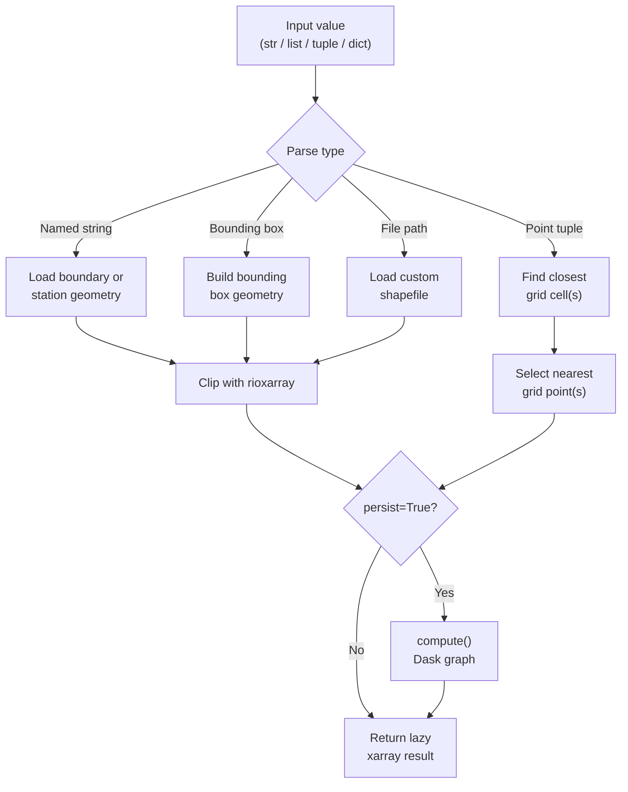

# Processor: Clip

**Registry key:** `clip` &nbsp;|&nbsp; **Priority:** 65 &nbsp;|&nbsp; **Category:** Spatial Processing

Subset climate data to specific geographic regions, points, or boundaries. Extract data for counties, watersheds, weather stations, or custom lat/lon coordinates with automatic nearest-gridcell location and coordinate system handling.

## Algorithm



`Clip` runs in two phases: first it parses `self.value` into a geometry (or routes to a point-based path), then it dispatches over the input data type and calls the appropriate clipper. See [Geometry Loading](#geometry-loading) and [Result Dispatch](#result-dispatch) in the Implementation Details section below.

## Input Modes

### Mode 1: Named Boundaries
Clip using predefined administrative or utility boundaries from the Cal-Adapt boundary catalog.

**Examples:**
```python
"Los Angeles"              # County name
"San Francisco Bay"        # Watershed
"CA"                       # State-wide
"CA_IOU"                   # Utility (IOU = Investor-Owned Utility)
```

### Mode 2: Weather Stations
Clip to specific weather station locations from the HadISD station network.

**Examples:**
```python
"KSAC"                     # Sacramento International Airport
"KSFO"                     # San Francisco International Airport  
"KLAX"                     # Los Angeles International Airport
```

### Mode 3: Single Point (Closest Valid Gridcell)
Extract data for a single geographic point. The processor first selects the geographically closest gridcell; if that cell is all-NaN (common in WRF data near coastlines/mountains/masked regions) it falls back to a **3×3 index-space neighborhood** around the nearest cell and returns the **mean of the valid (non-NaN) cells in that neighborhood**.

**Algorithm (`_clip_data_to_point`, line 665):**

1. Call `get_closest_gridcell(dataset, lat, lon)` and check if it has valid data on a sample slice.
2. If valid, return that cell.
3. If NaN, find the nearest grid index (`(idx1, idx2)`) along the spatial dims (`x`/`y` for WRF, `lat`/`lon` for LOCA2). For projected grids, lat/lon are first transformed to the dataset's CRS via `pyproj.Transformer`.
4. Iterate the 3×3 neighborhood `(di, dj) ∈ {-1, 0, 1}²`, skipping out-of-bounds and all-NaN cells.
5. If any valid neighbors exist, `xr.concat(neighbors, dim="nearest_cell").mean(dim="nearest_cell")` and reassign mean lat/lon coords; otherwise return `None`.
6. Fallback paths handle averaging failures by returning the center cell directly.

> The earlier docs described an expanding-radius search (0.01° → 0.05° → ... → 0.5°). That was never the implementation; the current behavior is the index-space 3×3 mean above.

**Example:**
```python
(37.7749, -122.4194)       # San Francisco: (lat, lon)
```

### Mode 4: Bounding Box
Clip data to a rectangular geographic region specified by latitude and longitude ranges.

**Example:**
```python
((36.0, 39.0), (-122.0, -118.0))   # ((lat_min, lat_max), (lon_min, lon_max))
```

### Mode 5: Custom File
Clip using geometry from shapefile or GeoJSON file.

**Example:**
```python
"/path/to/custom_region.shp"       # Shapefile with geometry
```

## Multi-Input Handling

### Multiple Boundaries
When providing a list of boundary names, they are combined using **union** (OR logic):

```python
["Alameda", "Contra Costa", "Santa Clara"]  # All three counties combined
```

**With separation:**
```python
{"boundaries": ["Alameda", "Contra Costa"], "separated": True}
# Returns: Dict with separate Dataset for each county
```

### Multiple Points
When providing multiple point coordinates:
- Each point gets independent smart-gridcell search
- Results include `closest_cell` dimension with length = number of points
- Automatic duplicate filtering if multiple points map to same gridcell

**Example:**
```python
[(37.7749, -122.4194), (34.0522, -118.2437), (32.7157, -117.1611)]
# Returns: Dataset with closest_cell dimension = 3 (SF, LA, San Diego)
```

## Spatial Processing Details

### Coordinate System Handling
- **Data CRS detection** (`_clip_data_with_geom`, line 595): if `data.rio.crs` is unset, the processor detects WRF data by the presence of a `Lambert_Conformal` coordinate and writes the CRS from `spatial_ref` or CF-convention attributes; otherwise it assumes EPSG:4326 (LOCA2 lat/lon).
- **Boundary CRS**: boundaries are assumed to be EPSG:4326 (a warning is logged if no CRS is set).
- **Reprojection direction**: when `data.rio.crs != gdf.crs`, the **GeoDataFrame is reprojected to the data's CRS** — the data stays in its native projection (i.e., WRF output remains in Lambert Conformal).

### Masking Strategy
Geometry-based clipping uses `rioxarray`:

```python
data.rio.clip(gdf.geometry.apply(mapping), gdf.crs, drop=True, all_touched=True)
```

- `all_touched=True` includes cells that any part of the geometry touches.
- `drop=True` trims the bounding box to the clipped extent.

For multi-point clipping, `_clip_data_to_points_as_mask` either applies a points-mask in place or extracts along a new `points` dimension when `extract_points=True` (set by `{"points": [...], "separated": True}`).

### Persisting to Memory
When `persist=True` (constructor arg or `persist` key in dict input), the processor calls `.compute()` on the result before returning. This collapses the Dask task graph and is recommended for large multi-point clipping followed by 1-in-X analysis or other graph-heavy operations.

### Boundary Catalog Access
- Boundaries loaded lazily via `_get_boundary_geometry` (line 1443) / `_get_multi_boundary_geometry` (line 1683).
- Sourced from S3 intake-esm catalog and cached for the process lifetime.

## Parameters

| Parameter | Type | Required | Default | Description |
|-----------|------|----------|---------|-------------|
| `value` | str / list / tuple / dict | ✓ | — | Geometry specification (modes 1–5 above). For dict input, must contain `boundaries` *or* `points`. |
| `separated` | bool (in dict input) | | False | For boundaries: keep each as its own dataset entry. For points: extract along a new `points` dimension. |
| `persist` | bool (in dict input or constructor) | | False | Call `.compute()` after clipping to collapse the Dask task graph. Recommended for large multi-point workflows. |

## Code References

| Method | Lines | Purpose |
|--------|-------|---------|
| `__init__` | [186–291](https://github.com/cal-adapt/climakitae/blob/main/climakitae/new_core/processors/clip.py#L186) | Parse `value`, set mode flags (`is_single_point`, `is_multi_point`, `separated`, `extract_points`, `persist`) |
| `execute` | [294–477](https://github.com/cal-adapt/climakitae/blob/main/climakitae/new_core/processors/clip.py#L294) | Two-phase: parse value → geom (line 303), then dispatch over result type (line 386); optional `.compute()` if `persist` |
| `update_context` | [479–535](https://github.com/cal-adapt/climakitae/blob/main/climakitae/new_core/processors/clip.py#L479) | Record clipped-region metadata under `new_attrs["clip"]` |
| `set_data_accessor` | [537–539](https://github.com/cal-adapt/climakitae/blob/main/climakitae/new_core/processors/clip.py#L537) | Receive `DataCatalog` reference for boundary/station lookups |
| `_get_station_coordinates` | [541–568](https://github.com/cal-adapt/climakitae/blob/main/climakitae/new_core/processors/clip.py#L541) | HadISD station code → (lat, lon, metadata) |
| `_convert_stations_to_points` | [570–593](https://github.com/cal-adapt/climakitae/blob/main/climakitae/new_core/processors/clip.py#L570) | Multi-station list → point_list + metadata list |
| `_clip_data_with_geom` | [595–663](https://github.com/cal-adapt/climakitae/blob/main/climakitae/new_core/processors/clip.py#L595) | CRS detection + `rio.clip(all_touched=True, drop=True)` |
| `_clip_data_to_point` | [665–878](https://github.com/cal-adapt/climakitae/blob/main/climakitae/new_core/processors/clip.py#L665) | Closest cell, fallback to 3×3 index-space neighborhood mean |
| `_clip_data_to_multiple_points` | [880–961](https://github.com/cal-adapt/climakitae/blob/main/climakitae/new_core/processors/clip.py#L880) | Vectorized multi-point selection |
| `_clip_data_to_multiple_points_fallback` | [963–1059](https://github.com/cal-adapt/climakitae/blob/main/climakitae/new_core/processors/clip.py#L963) | Fallback path used when vectorized lookup fails |
| `_clip_data_to_points_as_mask` | [1061–1346](https://github.com/cal-adapt/climakitae/blob/main/climakitae/new_core/processors/clip.py#L1061) | Mask-based multi-point clip; supports `extract_points` along new `points` dim |
| `_clip_data_separated` | [1348–1441](https://github.com/cal-adapt/climakitae/blob/main/climakitae/new_core/processors/clip.py#L1348) | Per-boundary clipping returning dict/list keyed by boundary |
| `_get_boundary_geometry` | [1443–1503](https://github.com/cal-adapt/climakitae/blob/main/climakitae/new_core/processors/clip.py#L1443) | Single boundary key → GeoDataFrame |
| `_get_multi_boundary_geometry` | [1683–1749](https://github.com/cal-adapt/climakitae/blob/main/climakitae/new_core/processors/clip.py#L1683) | Multi-boundary union via `_combine_geometries` |
| `_combine_geometries` | [1751–](https://github.com/cal-adapt/climakitae/blob/main/climakitae/new_core/processors/clip.py#L1751) | Geometry union helper |

## Examples

### Single County

```python
from climakitae.new_core.user_interface import ClimateData

data = (ClimateData()
    .catalog("cadcat")
    .activity_id("WRF")
    .variable("t2max")
    .table_id("day")
    .grid_label("d03")
    .processes({
        "clip": "Alameda"
    })
    .get())
```

### Multiple Counties (Separated)

```python
# Get each county in separate dataset
data = (ClimateData()
    .catalog("cadcat")
    .activity_id("WRF")
    .variable("pr")
    .table_id("mon")
    .grid_label("d02")
    .processes({
        "clip": {
            "boundaries": ["Alameda", "Contra Costa", "Santa Clara"],
            "separated": True
        }
    })
    .get())

# data is dict: {"Alameda": ds1, "Contra Costa": ds2, "Santa Clara": ds3}
```

### Single Lat/Lon Point

```python
# Closest grid cell to San Francisco
data = (ClimateData()
    .catalog("cadcat")
    .activity_id("WRF")
    .variable("t2max")
    .table_id("day")
    .grid_label("d03")
    .processes({
        "clip": (37.7749, -122.4194)
    })
    .get())

# Scalar lat/lon coordinates (size 1)
```

### Multiple Points (Separated)

```python
# Time series for 3 cities
locations = [
    (34.05, -118.25),    # Los Angeles
    (37.77, -122.42),    # San Francisco
    (32.72, -117.16)     # San Diego
]

data = (ClimateData()
    .catalog("cadcat")
    .activity_id("WRF")
    .variable("t2max")
    .table_id("day")
    .grid_label("d03")
    .processes({
        "clip": {
            "boundaries": locations,
            "separated": True,
            "location_based_naming": True
        }
    })
    .get())

# data is dict with lat/lon in keys
```

### Bounding Box

```python
# Bay Area region (rough bbox)
data = (ClimateData()
    .catalog("cadcat")
    .activity_id("WRF")
    .variable("pr")
    .table_id("mon")
    .grid_label("d03")
    .processes({
        "clip": ((37.5, 38.5), (-123.0, -121.5))
    })
    .get())
```

### Weather Station

```python
# Sacramento airport observations reference point
data = (ClimateData()
    .catalog("cadcat")
    .activity_id("WRF")
    .variable("t2max")
    .table_id("day")
    .grid_label("d03")
    .processes({
        "clip": "KSAC"
    })
    .get())
```

### Chained: Clip → Warming Level → Export

```python
data = (ClimateData()
    .catalog("cadcat")
    .activity_id("WRF")
    .experiment_id("ssp245")
    .variable("t2max")
    .table_id("day")
    .grid_label("d03")
    .processes({
        "clip": "Los Angeles",
        "warming_level": {"warming_levels": [1.5, 2.0, 3.0]},
        "export": {
            "filename": "la_warming",
            "file_format": "NetCDF"
        }
    })
    .get())
```

## Implementation Details

### Geometry Loading

Clip resolves `self.value` to a geometry (or to a point-mode flag) in this order:

1. **String** → station id (`is_station_identifier`, line 305) → file path (`os.path.exists`, line 318) → boundary key (`_get_boundary_geometry`, line 320).
2. **List** → all-station list (line 324) → lat/lon tuples (`is_multi_point`, line 340) → separated boundaries (line 343) → union of boundaries (`_get_multi_boundary_geometry`, line 345).
3. **Tuple** → single `(lat, lon)` (line 347) or bbox `((lat_min, lat_max), (lon_min, lon_max))` (line 355, builds `shapely.box` in EPSG:4326).

### Result Dispatch

The second `match` (line 386) routes the input data:

- **dict**: per-key clip; mode flag selects the clipper.
- **Dataset / DataArray**: single clip via the matching mode’s clipper.
- **list / tuple**: per-item clip, container type preserved; `None` results filtered out for point modes.

### Persist (`persist=True`)

After clipping, if `self.persist` is true the processor calls `.compute()` on the result (per-value for dicts, on the whole object otherwise). This collapses very large Dask task graphs that arise from multi-point clipping followed by quantile or block operations and prevents OOMs in downstream steps.

### Error Handling

- Invalid station code, missing boundary key, or unsupported `value` type → `ValueError`.
- All-NaN single point with no valid 3×3 neighbors → `_clip_data_to_point` returns `None`; the per-item paths filter these out.
- Failed CRS detection on WRF data missing required CF attributes → `ValueError` with the missing key.

## Common Patterns

### County Loop

```python
import climakitae

counties = ["Alameda", "Contra Costa", "Santa Clara", "San Mateo"]
data_by_county = {}

for county in counties:
    data_by_county[county] = (ClimateData()
        .catalog("cadcat")
        .activity_id("WRF")
        .variable("t2max")
        .table_id("day")
        .grid_label("d03")
        .processes({"clip": county})
        .get())
```

### Urban Heat Island Study

```python
# Urban and rural points for comparison
urban_point = (37.7749, -122.4194)      # San Francisco downtown
rural_point = (37.5, -122.0)            # Sierra foothills

data = (ClimateData()
    .catalog("cadcat")
    .activity_id("WRF")
    .variable("t2max")
    .table_id("day")
    .grid_label("d03")
    .processes({
        "clip": {
            "boundaries": [urban_point, rural_point],
            "separated": True
        }
    })
    .get())

# data["urban_point"] vs data["rural_point"] comparison
```

## See Also

- [Processor Index](index.md)
- [Architecture → Spatial Subsetting](../architecture.md#spatial-subsetting)
- [How-To Guides → Clipping Data](../howto/clip.md)
- [CA Boundaries Reference](../concepts.md#available-boundaries)
