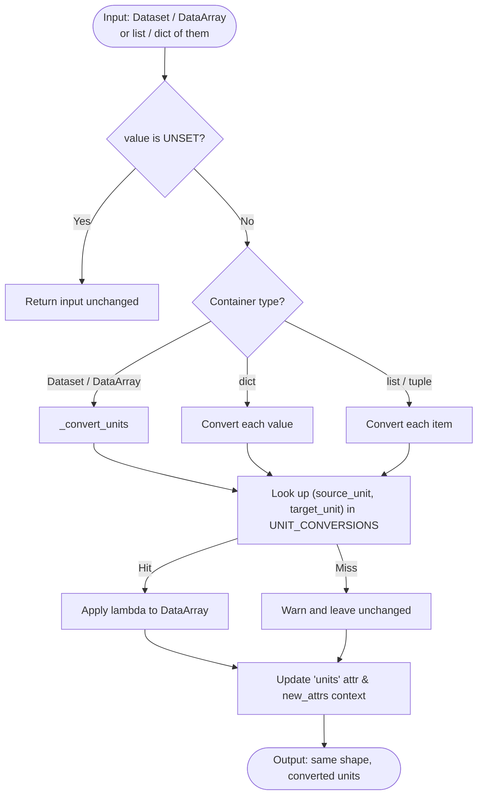

# Processor: ConvertUnits

**Registry key:** `convert_units` &nbsp;|&nbsp; **Priority:** 5 &nbsp;|&nbsp; **Category:** Data Conversion

Convert climate variables to different units. The processor reads each variable's existing `units` attribute and applies a conversion lambda from a fixed `(source, target)` lookup table defined in [`convert_units.py`](https://github.com/cal-adapt/climakitae/blob/main/climakitae/new_core/processors/convert_units.py).

## Algorithm



## Parameter shape

The processor takes a **single string**: the target unit. The source unit is read from the variable's `units` attribute.

```python
.processes({"convert_units": "<target unit>"})
```

| Field | Type | Description |
|-------|------|-------------|
| `value` | `str` | Target unit. Must form a registered `(source, target)` pair with each variable's existing `units`; mismatches log a warning and leave the variable unchanged. |

## Supported conversions

Pairs registered in `UNIT_CONVERSIONS` (see source for the full table):

| Quantity | Source → Target |
|----------|-----------------|
| Temperature | `K → degC`, `K → degF`, `degC → K`, `degC → degF`, `degF → degC`, `degF → K` |
| Precipitation (depth) | `mm → inches`, `mm/d → inches/d`, `mm/h → inches/h` |
| Precipitation (flux ↔ depth) | `mm ↔ kg m-2 s-1`, `inches ← kg m-2 s-1` |
| Wind speed | `m/s → knots`, `m/s → mph`, `m s-1 → knots`, `m s-1 → mph` |
| Pressure | `hPa → Pa`, `hPa → mb`, `hPa → inHg`, `Pa → hPa`, `Pa → mb`, `Pa → inHg` |
| Moisture ratio | `kg/kg ↔ g/kg`, `kg kg-1 → g kg-1` |
| Relative humidity | `[0 to 100] → fraction` |

## Examples

### Temperature: Kelvin → Fahrenheit

```python
from climakitae.new_core.user_interface import ClimateData

data = (ClimateData()
    .catalog("cadcat")
    .activity_id("WRF")
    .institution_id("UCLA")
    .variable("t2max")
    .table_id("day")
    .grid_label("d03")
    .processes({"convert_units": "degF"})
    .get())
```

### Precipitation: mm/day → inches/day

```python
data = (ClimateData()
    .catalog("cadcat")
    .activity_id("LOCA2")
    .variable("pr")
    .table_id("day")
    .grid_label("d03")
    .processes({"convert_units": "inches/d"})
    .get())
```

## Behavior notes

- If `value` is left unset, the processor is a no-op.
- If `(source_unit, target_unit)` is not registered, the processor logs a warning and returns the variable unchanged.
- Runs at priority **5** — early in the pipeline, so downstream processors (e.g. `metric_calc` thresholds) operate on already-converted units.
- Records the conversion in dataset attributes via the shared `new_attrs` context key.

## See also

- [Processor index](index.md)
- [`climakitae/new_core/processors/convert_units.py`](https://github.com/cal-adapt/climakitae/blob/main/climakitae/new_core/processors/convert_units.py)
- Cal-Adapt: Analytics Engine — [Glossary](https://analytics.cal-adapt.org/guidance/glossary)
