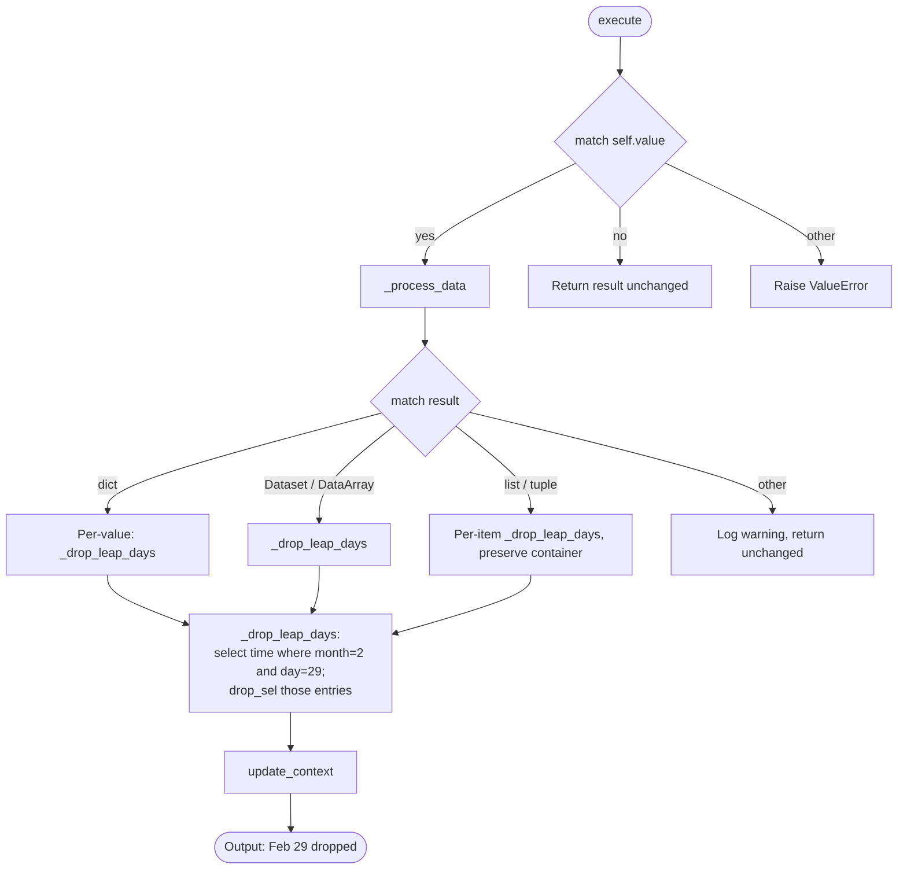

# Processor: DropLeapDays

**Registry key:** `drop_leap_days` &nbsp;|&nbsp; **Priority:** 1 &nbsp;|&nbsp; **Category:** Calendar Processing

Remove February 29 entries from the time dimension. Useful when aligning datasets that use different calendar conventions (e.g., 365-day vs Gregorian) for ensemble work.

## Algorithm



## Parameters

The processor takes a **single string** (not a dict):

| Field | Type | Default | Description |
|-------|------|---------|-------------|
| `value` | `str` | `"yes"` | `"yes"` to drop Feb 29; `"no"` to pass through unchanged. Anything else raises `ValueError`. |

> Earlier docs claimed "no configuration needed" and showed `"drop_leap_days": {}` as the example. That call would actually raise an `AttributeError` because `__init__` calls `value.lower()`. Use `"drop_leap_days": "yes"` or simply omit the processor.

If the data lacks a `time` dimension, `_drop_leap_days` returns it unchanged. If no Feb 29 entries are found, it also returns unchanged.

## Example

```python
from climakitae.new_core.user_interface import ClimateData

data = (ClimateData()
    .catalog("cadcat")
    .activity_id("WRF")
    .institution_id("UCLA")
    .variable("t2max")
    .table_id("day")
    .grid_label("d03")
    .processes({"drop_leap_days": "yes"})
    .get())
```

## Code References

| Method | Lines | Purpose |
|--------|-------|---------|
| `__init__` | [48–61](https://github.com/cal-adapt/climakitae/blob/main/climakitae/new_core/processors/drop_leap_days.py#L48) | Lowercase and store value |
| `execute` | [63–111](https://github.com/cal-adapt/climakitae/blob/main/climakitae/new_core/processors/drop_leap_days.py#L63) | `match self.value` (yes/no/other) |
| `_process_data` | [113–152](https://github.com/cal-adapt/climakitae/blob/main/climakitae/new_core/processors/drop_leap_days.py#L113) | Dispatch over result type via `match result` |
| `update_context` | [154–172](https://github.com/cal-adapt/climakitae/blob/main/climakitae/new_core/processors/drop_leap_days.py#L154) | Tag `new_attrs` with applied operation |
| `_drop_leap_days` | [178–](https://github.com/cal-adapt/climakitae/blob/main/climakitae/new_core/processors/drop_leap_days.py#L178) | Build `time` mask and call `drop_sel` |

## See also

- [Processor index](index.md)
- [`climakitae/new_core/processors/drop_leap_days.py`](https://github.com/cal-adapt/climakitae/blob/main/climakitae/new_core/processors/drop_leap_days.py)
