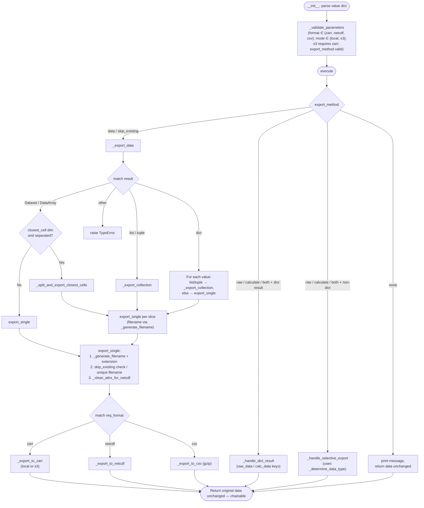

# Processor: Export

**Registry key:** `export` &nbsp;|&nbsp; **Priority:** 9999 &nbsp;|&nbsp; **Category:** I/O & Archival

Write climate data to disk in NetCDF, Zarr, or CSV. Handles gridded datasets, multi-point clip results (`closest_cell` dimension), and collections (lists/tuples/dicts of single-point datasets) with optional location-based filenames and S3 storage for Zarr.

## Algorithm

`Export` runs at priority 9999 (last). It dispatches by `export_method` first, then by data structure.



## Data Handling Modes

### Mode 1: Gridded Datasets ⚠️ Important
Single xr.Dataset/xr.DataArray with `lat` and `lon` coordinate dimensions containing multiple values (e.g., shape `(time, lat, lon)`).

**Key Behavior:**
- Options `separated` and `location_based_naming` are **silently ignored**
- Always exports to a **single file** (cannot split gridded data by location)
- Single filename used with extension based on format

**Example Input:**
```python
# Dataset from clip with single region or full state
ds.dims  # {'time': 8760, 'lat': 150, 'lon': 100, 'sim': 5}
```

**Parameters Effective for This Mode:**
- `filename`: Used for single output file
- `file_format`: Determines output format
- `export_method`: Controls return value
- `mode`: For Zarr only

**Parameters Ignored for This Mode:**
- `separated` (always False, cannot split gridded data)
- `location_based_naming` (no point coordinates to include)

### Mode 2: Multi-Point Clip Results
Single xr.Dataset/xr.DataArray with `closest_cell` dimension (output from clipping to multiple lat/lon points). The `closest_cell` dimension represents individual target points.

**Key Behavior:**
- When `separated=True`: Data **splits along `closest_cell` dimension**
- Each slice becomes separate file with index or location-based name
- When `separated=False`: All points in single file with `closest_cell` dimension preserved

**Example Input:**
```python
# Dataset from clip with multiple points
ds.dims  # {'time': 8760, 'closest_cell': 3, 'sim': 5}
# 3 points: LA, SF, SD
```

**With `separated=True` + `location_based_naming=True`:**
```
myfile_34-05N_118-25W.nc  # LA
myfile_37-77N_122-42W.nc  # SF
myfile_32-72N_117-16W.nc  # SD
```

**With `separated=True` + `location_based_naming=False`:**
```
myfile_0.nc  # LA
myfile_1.nc  # SF
myfile_2.nc  # SD
```

**With `separated=False`:**
```
myfile.nc  # All 3 points, closest_cell dimension preserved
```

### Mode 3: Point Collections
A **list** or **dict** of xr.Dataset/xr.DataArray objects, where each item represents a single spatial point (scalar `lat`/`lon` coordinates with size 1).

**Typical Sources:**
- Output from `batch_select()` with `return_data_and_metadata=False`
- Lists returned by multi-point clipping with `separated=True`
- Custom collections of point time series

**Example Input:**
```python
# List of 3 datasets, each a single point
data = [
    ds_la,  # shape (time: 8760, sim: 5)
    ds_sf,  # shape (time: 8760, sim: 5)
    ds_sd   # shape (time: 8760, sim: 5)
]
```

**With `separated=True` + `location_based_naming=True`:**
- Each dataset exported separately
- Filenames use lat/lon from dataset coordinates

```
myfile_34-05N_118-25W.nc  # LA
myfile_37-77N_122-42W.nc  # SF
myfile_32-72N_117-16W.nc  # SD
```

**With `separated=True` + `location_based_naming=False`:**
```
myfile_0.nc
myfile_1.nc
myfile_2.nc
```

**With `separated=False`:**
- Each dataset exports with base filename
- Duplicate filenames get `_1`, `_2`, `_3` suffixes

## Export Formats

| Format | Use Case | Compression | Local/S3 | Notes |
|--------|----------|-------------|----------|-------|
| **NetCDF** | Climate data standard, archival | netCDF4 / zlib | Local only | Default; preserves CF metadata |
| **Zarr** | Cloud / chunked I/O | Internal | Both (S3 requires `mode="s3"`) | Path: `s3://bucket/...zarr` |
| **CSV** | Tabular / spreadsheets | gzip (`.csv.gz`) | Local only | Slow for large datasets |

> The Export processor does **not** support GeoTIFF. For GIS raster output, use `rioxarray` directly on the returned `xr.Dataset` after `.get()`.

### Format-Specific Notes

**NetCDF (`_export_to_netcdf`)**
- Attributes are sanitized via `_clean_attrs_for_netcdf` before writing.
- Best for archival, ncdump-readable.

**Zarr (`_export_to_zarr`)**
- `mode="local"` (default) writes to current working directory.
- `mode="s3"` writes to S3 — requires bucket configured outside the processor; only `Zarr` is allowed when `mode="s3"`.
- Attributes also sanitized prior to write to keep parity with the NetCDF path.

**CSV (`_export_to_csv`)**
- gzip-compressed (`.csv.gz`).
- Practical only for small / point datasets.

## Parameters

| Parameter | Type | Mode(s) | Description | Constraints |
|-----------|------|---------|-------------|-------------|
| `filename` | str | All | Base filename (no extension) | Default: `"dataexport"` |
| `file_format` | str | All | Output format | `"NetCDF"`, `"Zarr"`, `"CSV"` (case-insensitive; aliases inferred) |
| `mode` | str | All | Storage destination | `"local"` or `"s3"`; `"s3"` requires `file_format="Zarr"` |
| `separated` | bool | 2, 3 | Export items to separate files | Ignored for gridded data without `closest_cell` |
| `location_based_naming` | bool | 2, 3 | Use lat/lon in filenames | Effective when items have scalar lat/lon |
| `filename_template` | str / None | All | Custom filename template | Optional |
| `export_method` | str | All | Return / handler routing | `"data"`, `"skip_existing"`, `"raw"`, `"calculate"`, `"both"`, `"none"` |
| `raw_filename` | str / None | — | Custom name for raw export | Used by `_handle_dict_result` / `_handle_selective_export` |
| `calc_filename` | str / None | — | Custom name for calculated export | Used by `_handle_dict_result` / `_handle_selective_export` |
| `fail_on_error` | bool | All | Raise vs warn on write failure | Default: bool |

## Code References

| Method | Lines | Purpose |
|--------|-------|---------|
| `__init__` | [197–237](https://github.com/cal-adapt/climakitae/blob/main/climakitae/new_core/processors/export.py#L197) | Parse `value` dict, set defaults |
| `_validate_parameters` | [238–325](https://github.com/cal-adapt/climakitae/blob/main/climakitae/new_core/processors/export.py#L238) | Validate format / mode / export_method / types |
| `execute` | [326–393](https://github.com/cal-adapt/climakitae/blob/main/climakitae/new_core/processors/export.py#L326) | Route by `export_method`; returns input unchanged |
| `_export_data` | [394–455](https://github.com/cal-adapt/climakitae/blob/main/climakitae/new_core/processors/export.py#L394) | `match result` dispatcher (Dataset/DataArray, dict, list/tuple) |
| `_export_collection` | [457–511](https://github.com/cal-adapt/climakitae/blob/main/climakitae/new_core/processors/export.py#L457) | List/tuple handler honoring `separated` and `location_based_naming` |
| `_export_single_from_collection` | [513–571](https://github.com/cal-adapt/climakitae/blob/main/climakitae/new_core/processors/export.py#L513) | Per-item write inside `_export_collection` |
| `_handle_dict_result` | [573–588](https://github.com/cal-adapt/climakitae/blob/main/climakitae/new_core/processors/export.py#L573) | `raw_data` / `calc_data` dict (e.g., `cava_data`) |
| `_handle_selective_export` | [590–618](https://github.com/cal-adapt/climakitae/blob/main/climakitae/new_core/processors/export.py#L590) | Selective raw/calculate/both for non-dict inputs |
| `_determine_data_type` | [620–646](https://github.com/cal-adapt/climakitae/blob/main/climakitae/new_core/processors/export.py#L620) | Classify input as raw vs calculated |
| `_export_with_suffix` | [648–674](https://github.com/cal-adapt/climakitae/blob/main/climakitae/new_core/processors/export.py#L648) | Append suffix (`_raw`, `_calc`) and write |
| `update_context` | [676–696](https://github.com/cal-adapt/climakitae/blob/main/climakitae/new_core/processors/export.py#L676) | Record export metadata in context |
| `_clean_attrs_for_netcdf` | [702–761](https://github.com/cal-adapt/climakitae/blob/main/climakitae/new_core/processors/export.py#L702) | Sanitize attrs for NetCDF/Zarr serialization |
| `_is_single_point_data` | [763–785](https://github.com/cal-adapt/climakitae/blob/main/climakitae/new_core/processors/export.py#L763) | Detect scalar lat/lon |
| `_has_closest_cell_dimension` | [787–818](https://github.com/cal-adapt/climakitae/blob/main/climakitae/new_core/processors/export.py#L787) | Multi-point clip detection |
| `_split_and_export_closest_cells` | [820–902](https://github.com/cal-adapt/climakitae/blob/main/climakitae/new_core/processors/export.py#L820) | Split along `closest_cell` and write each slice |
| `_extract_point_coordinates` | [904–964](https://github.com/cal-adapt/climakitae/blob/main/climakitae/new_core/processors/export.py#L904) | Pull (lat, lon) for filename suffix |
| `_generate_filename` | [966–1030](https://github.com/cal-adapt/climakitae/blob/main/climakitae/new_core/processors/export.py#L966) | Build base filename (location_based or template) |
| `_get_unique_filename` | [1032–1062](https://github.com/cal-adapt/climakitae/blob/main/climakitae/new_core/processors/export.py#L1032) | Add `_1`, `_2`, ... when target exists |
| `export_single` | [1064–1127](https://github.com/cal-adapt/climakitae/blob/main/climakitae/new_core/processors/export.py#L1064) | `match req_format` and call format writer |
    .table_id("day")
    .grid_label("d03")
    .processes({
        "time_slice": ("2015-01-01", "2015-12-31"),
        "clip": (37.77, -122.42),  # Single point
        "export": {
            "filename": "sf_daily_max_temp",
            "file_format": "CSV"
        }
    })
    .get())

# Writes: sf_daily_max_temp.csv
# Columns: time, t2max (one row per day)
```

## Implementation Details

### Format-Specific Behavior

**NetCDF**: Uses xarray `.to_netcdf()` with CF conventions and compression

```python
data.to_netcdf(filename, engine="netcdf4", encoding={var: {"zlib": True} for var in data.data_vars})
```

**Zarr**: Chunked cloud-optimized format (local or S3)

```python
if mode == "s3":
    data.to_zarr(f"s3://bucket/{filename}.zarr")
else:
    data.to_zarr(f"./{filename}.zarr")
```

**CSV**: Flattens spatial dims; requires scalar or point data

```python
data.to_csv(filename)  # Works for time series at single points
```

### Skip Existing

With `export_method="skip_existing"`, processor checks if file exists before writing:

```python
if os.path.exists(filename):
    return None  # Don't overwrite
else:
    export_and_return_path(data, filename)
```

### Location-Based Naming

Coordinates are formatted as compass directions:

```python
# (37.7749, -122.4194) → "37-77N_122-42W"
lat_str = f"{abs(lat):.2f}{'NS'[lat < 0]}"
lon_str = f"{abs(lon):.2f}{'EW'[lon < 0]}"
filename = f"{base}_{lat_str}_{lon_str}.{ext}"
```

## Common Patterns

### Multi-Format Export

```python
data = (ClimateData()
    .catalog("cadcat")
    .activity_id("WRF")
    .variable("t2max")
    .table_id("day")
    .grid_label("d03")
    .processes({
        "time_slice": ("2015-01-01", "2015-12-31"),
        "clip": "Alameda"
    })
    .get())

# Export to multiple formats
data.to_netcdf("alameda_2015.nc")
data.to_zarr("alameda_2015.zarr")
data.to_csv("alameda_2015.csv")
```

### Batch Export Loop

```python
counties = ["Alameda", "Contra Costa", "Santa Clara"]
for county in counties:
    (ClimateData()
        .catalog("cadcat")
        .activity_id("WRF")
        .variable("t2max")
        .table_id("day")
        .grid_label("d03")
        .processes({
            "clip": county,
            "export": {
                "filename": f"{county.lower()}_2015",
                "file_format": "NetCDF"
            }
        })
        .get())
```

## See Also

- [Processor Index](index.md)
- [How-To Guides → Export Data](../howto/export.md)
- [Architecture → Data Export](../architecture.md#data-export-pipeline)
- xarray export docs: [.to_netcdf()](https://docs.xarray.dev/en/stable/generated/xarray.Dataset.to_netcdf.html)
