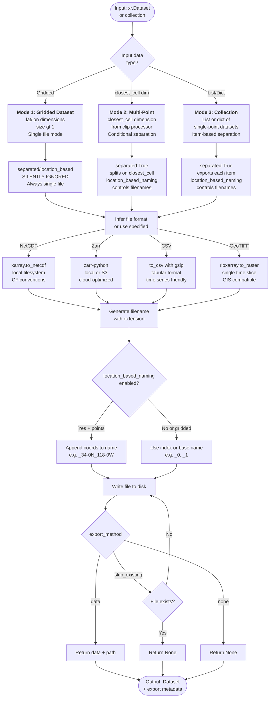

# Processor: Export

**Registry key:** `export` &nbsp;|&nbsp; **Priority:** 9999 &nbsp;|&nbsp; **Category:** I/O & Archival

Write climate data to disk in multiple formats (NetCDF, Zarr, CSV, GeoTIFF). Handle gridded datasets, multi-point extractions, and point collections with optional location-based filenames, S3 cloud storage, and format-specific export methods.

## Algorithm

The processor handles **three distinct data structures** with conditional parameter behavior:



## Data Handling Modes

### Mode 1: Gridded Datasets ⚠️ Important
Single xr.Dataset/xr.DataArray with `lat` and `lon` coordinate dimensions containing multiple values (e.g., shape `(time, lat, lon)`).

**Key Behavior:**
- Options `separated` and `location_based_naming` are **silently ignored**
- Always exports to a **single file** (cannot split gridded data by location)
- Single filename used with extension based on format

**Example Input:**
```python
# Dataset from clip with single region or full state
ds.dims  # {'time': 8760, 'lat': 150, 'lon': 100, 'sim': 5}
```

**Parameters Effective for This Mode:**
- `filename`: Used for single output file
- `file_format`: Determines output format
- `export_method`: Controls return value
- `mode`: For Zarr only

**Parameters Ignored for This Mode:**
- `separated` (always False, cannot split gridded data)
- `location_based_naming` (no point coordinates to include)

### Mode 2: Multi-Point Clip Results
Single xr.Dataset/xr.DataArray with `closest_cell` dimension (output from clipping to multiple lat/lon points). The `closest_cell` dimension represents individual target points.

**Key Behavior:**
- When `separated=True`: Data **splits along `closest_cell` dimension**
- Each slice becomes separate file with index or location-based name
- When `separated=False`: All points in single file with `closest_cell` dimension preserved

**Example Input:**
```python
# Dataset from clip with multiple points
ds.dims  # {'time': 8760, 'closest_cell': 3, 'sim': 5}
# 3 points: LA, SF, SD
```

**With `separated=True` + `location_based_naming=True`:**
```
myfile_34-05N_118-25W.nc  # LA
myfile_37-77N_122-42W.nc  # SF
myfile_32-72N_117-16W.nc  # SD
```

**With `separated=True` + `location_based_naming=False`:**
```
myfile_0.nc  # LA
myfile_1.nc  # SF
myfile_2.nc  # SD
```

**With `separated=False`:**
```
myfile.nc  # All 3 points, closest_cell dimension preserved
```

### Mode 3: Point Collections
A **list** or **dict** of xr.Dataset/xr.DataArray objects, where each item represents a single spatial point (scalar `lat`/`lon` coordinates with size 1).

**Typical Sources:**
- Output from `batch_select()` with `return_data_and_metadata=False`
- Lists returned by multi-point clipping with `separated=True`
- Custom collections of point time series

**Example Input:**
```python
# List of 3 datasets, each a single point
data = [
    ds_la,  # shape (time: 8760, sim: 5)
    ds_sf,  # shape (time: 8760, sim: 5)
    ds_sd   # shape (time: 8760, sim: 5)
]
```

**With `separated=True` + `location_based_naming=True`:**
- Each dataset exported separately
- Filenames use lat/lon from dataset coordinates

```
myfile_34-05N_118-25W.nc  # LA
myfile_37-77N_122-42W.nc  # SF
myfile_32-72N_117-16W.nc  # SD
```

**With `separated=True` + `location_based_naming=False`:**
```
myfile_0.nc
myfile_1.nc
myfile_2.nc
```

**With `separated=False`:**
- Each dataset exports with base filename
- Duplicate filenames get `_1`, `_2`, `_3` suffixes

## Export Formats

| Format | Use Case | Compression | Local/S3 | Max Size | Speed |
|--------|----------|-------------|----------|----------|-------|
| **NetCDF** | Climate data standard, long-term archival | CF conventions + gzip | Local only | Unlimited | Fast |
| **Zarr** | Cloud access, distributed computing, multi-file | Internal (optional) | Both (S3) | Unlimited | Fast |
| **CSV** | Spreadsheet software, tabular analysis, publication | gzip optional | Local only | ~500MB practical | Slow |
| **GeoTIFF** | Raster maps, GIS software (QGIS, ArcGIS) | Single time slice | S3 capable | 4GB limit | Fast |

### Format-Specific Notes

**NetCDF:**
- CF conventions metadata preserved
- Human-readable with ncdump
- Local filesystem only
- Best for archival

**Zarr (S3 Mode):**
- Requires bucket configuration
- Streaming access without downloading
- Chunked storage for efficient access
- Path format: `s3://bucket/path/dataset.zarr`

**CSV:**
- Flattens multi-dimensional data to tabular format
- Header row with coordinate/variable names
- gzip compression applied by default
- Slow for large datasets (>500MB)

**GeoTIFF:**
- Single time slice per file (select with time index)
- Spatial reference (EPSG:4326) embedded
- Useful for static maps/visualizations
- Can be opened in QGIS, ArcGIS, Google Earth

## Parameters

| Parameter | Type | Mode(s) | Description | Constraints |
|-----------|------|---------|-------------|-------------|
| `filename` | str | All | Base filename (no extension) | Default: "dataexport" |
| `file_format` | str | All | Output format | "NetCDF", "Zarr", "CSV", "GeoTIFF" |
| `separated` | bool | 2, 3 | Export items to separate files | Ignored for Mode 1 |
| `location_based_naming` | bool | 2, 3 | Use lat/lon in filenames | Requires `separated=True` |
| `export_method` | str | All | Return behavior | "data", "skip_existing", "none" |
| `mode` | str | All (Zarr) | Storage destination | "local" or "s3" (Zarr only) |
| `raw_filename` | str | — | Custom name for raw export | For `export_method="both"` |
| `calc_filename` | str | — | Custom name for calculated export | For `export_method="both"` |

## Code References

| Method | Lines | Purpose |
|--------|-------|---------|
| `__init__` | [70–140](https://github.com/cal-adapt/climakitae/blob/main/climakitae/new_core/processors/export.py#L70) | Parse and validate export parameters |
| `execute` | [150–210](https://github.com/cal-adapt/climakitae/blob/main/climakitae/new_core/processors/export.py#L150) | Detect input type and route to handler |
| `_export_single_dataset` | [220–250](https://github.com/cal-adapt/climakitae/blob/main/climakitae/new_core/processors/export.py#L220) | Export gridded dataset (Mode 1) |
| `_export_with_closest_cell` | [260–300](https://github.com/cal-adapt/climakitae/blob/main/climakitae/new_core/processors/export.py#L260) | Export multi-point results (Mode 2) |
| `_export_collection` | [310–350](https://github.com/cal-adapt/climakitae/blob/main/climakitae/new_core/processors/export.py#L310) | Export point collection (Mode 3) |
| `_select_export_function` | [360–390](https://github.com/cal-adapt/climakitae/blob/main/climakitae/new_core/processors/export.py#L360) | Route to format-specific writer |
| `update_context` | [400–415](https://github.com/cal-adapt/climakitae/blob/main/climakitae/new_core/processors/export.py#L400) | Record export path and metadata |
    .table_id("day")
    .grid_label("d03")
    .processes({
        "time_slice": ("2015-01-01", "2015-12-31"),
        "clip": (37.77, -122.42),  # Single point
        "export": {
            "filename": "sf_daily_max_temp",
            "file_format": "CSV"
        }
    })
    .get())

# Writes: sf_daily_max_temp.csv
# Columns: time, t2max (one row per day)
```

### GeoTIFF for GIS

```python
# Single raster layer for ArcGIS/QGIS
data = (ClimateData()
    .catalog("cadcat")
    .activity_id("WRF")
    .variable("pr")
    .table_id("mon")
    .grid_label("d02")
    .processes({
        "time_slice": ("2015-06-01", "2015-08-31"),  # Summer
        "export": {
            "filename": "ca_summer_precip_2015",
            "file_format": "GeoTIFF"
        }
    })
    .get())

# Writes: ca_summer_precip_2015.tif
# GIS-compatible with lat/lon metadata
```

## Implementation Details

### Format-Specific Behavior

**NetCDF**: Uses xarray `.to_netcdf()` with CF conventions and compression

```python
data.to_netcdf(filename, engine="netcdf4", encoding={var: {"zlib": True} for var in data.data_vars})
```

**Zarr**: Chunked cloud-optimized format (local or S3)

```python
if mode == "s3":
    data.to_zarr(f"s3://bucket/{filename}.zarr")
else:
    data.to_zarr(f"./{filename}.zarr")
```

**CSV**: Flattens spatial dims; requires scalar or point data

```python
data.to_csv(filename)  # Works for time series at single points
```

**GeoTIFF**: Single time step, spatial (lat, lon) only

```python
data.isel(time=0).rio.to_raster(filename)  # Exports first time slice
```

### Skip Existing

With `export_method="skip_existing"`, processor checks if file exists before writing:

```python
if os.path.exists(filename):
    return None  # Don't overwrite
else:
    export_and_return_path(data, filename)
```

### Location-Based Naming

Coordinates are formatted as compass directions:

```python
# (37.7749, -122.4194) → "37-77N_122-42W"
lat_str = f"{abs(lat):.2f}{'NS'[lat < 0]}"
lon_str = f"{abs(lon):.2f}{'EW'[lon < 0]}"
filename = f"{base}_{lat_str}_{lon_str}.{ext}"
```

## Common Patterns

### Multi-Format Export

```python
data = (ClimateData()
    .catalog("cadcat")
    .activity_id("WRF")
    .variable("t2max")
    .table_id("day")
    .grid_label("d03")
    .processes({
        "time_slice": ("2015-01-01", "2015-12-31"),
        "clip": "Alameda"
    })
    .get())

# Export to multiple formats
data.to_netcdf("alameda_2015.nc")
data.to_zarr("alameda_2015.zarr")
data.to_csv("alameda_2015.csv")
```

### Batch Export Loop

```python
counties = ["Alameda", "Contra Costa", "Santa Clara"]
for county in counties:
    (ClimateData()
        .catalog("cadcat")
        .activity_id("WRF")
        .variable("t2max")
        .table_id("day")
        .grid_label("d03")
        .processes({
            "clip": county,
            "export": {
                "filename": f"{county.lower()}_2015",
                "file_format": "NetCDF"
            }
        })
        .get())
```

## See Also

- [Processor Index](index.md)
- [How-To Guides → Export Data](../howto.md#export-data)
- [Architecture → Data Export](../architecture.md#data-export-pipeline)
- xarray export docs: [.to_netcdf()](https://docs.xarray.dev/en/stable/generated/xarray.Dataset.to_netcdf.html)
