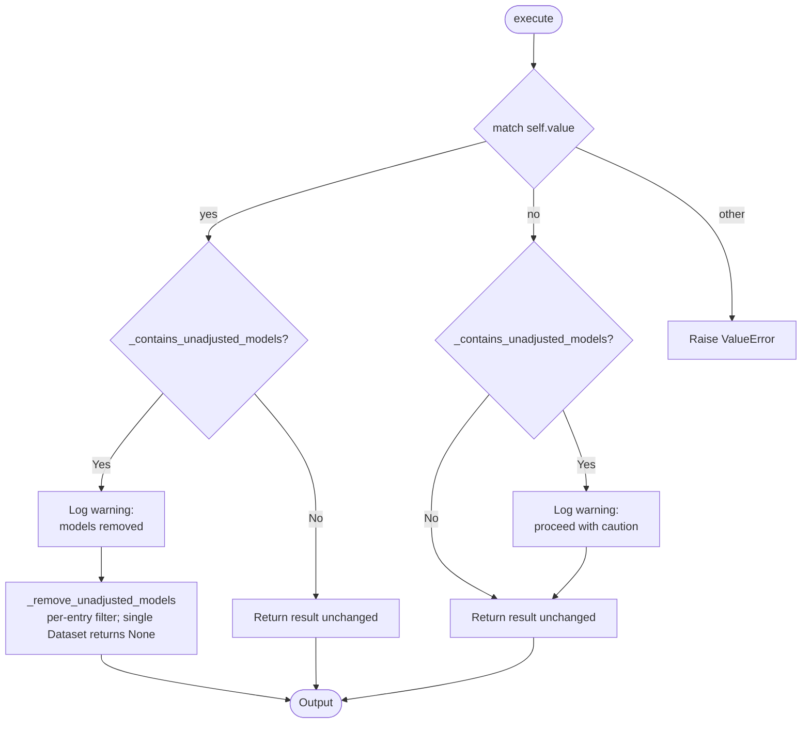

# Processor: FilterUnadjustedModels

**Registry key:** `filter_unadjusted_models` &nbsp;|&nbsp; **Priority:** 0 &nbsp;|&nbsp; **Category:** Data Selection

Drop WRF model entries whose `(activity_id, source_id, member_id)` tuple is in the curated `NON_WRF_BA_MODELS` list (models without a-priori bias adjustment). Used by default in the new-core pipeline so downstream analysis runs against a homogeneous WRF ensemble.

## Algorithm



### Membership test

`_contains_unadjusted_models` reads `intake_esm_attrs:activity_id`, `intake_esm_attrs:source_id`, and `intake_esm_attrs:member_id` from the dataset's `attrs`, joins them as `f"{activity}_{source}_{member}"`, and checks for membership in the `NON_WRF_BA_MODELS` constant in [`climakitae/core/constants.py`](https://github.com/cal-adapt/climakitae/blob/main/climakitae/core/constants.py).

For dict / list / tuple inputs the test recurses, returning `True` if any contained dataset is unadjusted. For a single matching `xr.Dataset`/`xr.DataArray`, `_remove_unadjusted_models` returns `None`; for a dict/list/tuple it removes only the matching entries and preserves the container type.

## Parameters

The processor takes a **single string** (case-insensitive):

| Field | Type | Allowed | Default | Description |
|-------|------|---------|---------|-------------|
| `value` | `str` | `"yes"` / `"no"` | `"yes"` | `"yes"` removes unadjusted entries; `"no"` keeps them but logs a warning. Anything else raises `ValueError`. |

!!! note "Default behavior"
    `ClimateData` inserts this processor automatically for bias-relevant WRF
    queries. To explicitly *include* unadjusted models, pass
    `"filter_unadjusted_models": "no"`.

## Examples

```python
from climakitae.new_core.user_interface import ClimateData

# Default: drop unadjusted models
data = (ClimateData()
    .catalog("cadcat").activity_id("WRF").institution_id("UCLA")
    .variable("t2max").table_id("day").grid_label("d03")
    .processes({"filter_unadjusted_models": "yes"})
    .get())

# Opt out: keep all models (warning logged)
data_all = (ClimateData()
    .catalog("cadcat").activity_id("WRF").institution_id("UCLA")
    .variable("t2max").table_id("day").grid_label("d03")
    .processes({"filter_unadjusted_models": "no"})
    .get())
```

## Code References

| Method | Link to Code | Purpose |
|--------|-------|---------|
| `__init__` | [View on Github](https://github.com/search?q=repo%3Acal-adapt%2Fclimakitae+symbol%3A__init__+path%3Afilter_unadjusted_models.py&type=code) | Lowercase + store value |
| `execute` | [View on Github](https://github.com/search?q=repo%3Acal-adapt%2Fclimakitae+symbol%3Aexecute+path%3Afilter_unadjusted_models.py&type=code) | `match self.value`; warn + filter or warn + pass |
| `_contains_unadjusted_models` | [View on Github](https://github.com/search?q=repo%3Acal-adapt%2Fclimakitae+symbol%3A_contains_unadjusted_models+path%3Afilter_unadjusted_models.py&type=code) | Build model_id from `intake_esm_attrs:*`, check NON_WRF_BA_MODELS |
| `_remove_unadjusted_models` | [View on Github](https://github.com/search?q=repo%3Acal-adapt%2Fclimakitae+symbol%3A_remove_unadjusted_models+path%3Afilter_unadjusted_models.py&type=code) | Drop matching entries; preserve container type |
| `update_context` | [View on Github](https://github.com/search?q=repo%3Acal-adapt%2Fclimakitae+symbol%3Aupdate_context+path%3Afilter_unadjusted_models.py&type=code) | (No-op for context attrs in this processor's flow) |
| `set_data_accessor` | [View on Github](https://github.com/search?q=repo%3Acal-adapt%2Fclimakitae+symbol%3Aset_data_accessor+path%3Afilter_unadjusted_models.py&type=code) | Unused stub |

## See also

- [Processor index](index.md)
- [`climakitae/new_core/processors/filter_unadjusted_models.py`](https://github.com/cal-adapt/climakitae/blob/main/climakitae/new_core/processors/filter_unadjusted_models.py)
- [`NON_WRF_BA_MODELS` and `WRF_BA_MODELS` in `core/constants.py`](https://github.com/cal-adapt/climakitae/blob/main/climakitae/core/constants.py)
