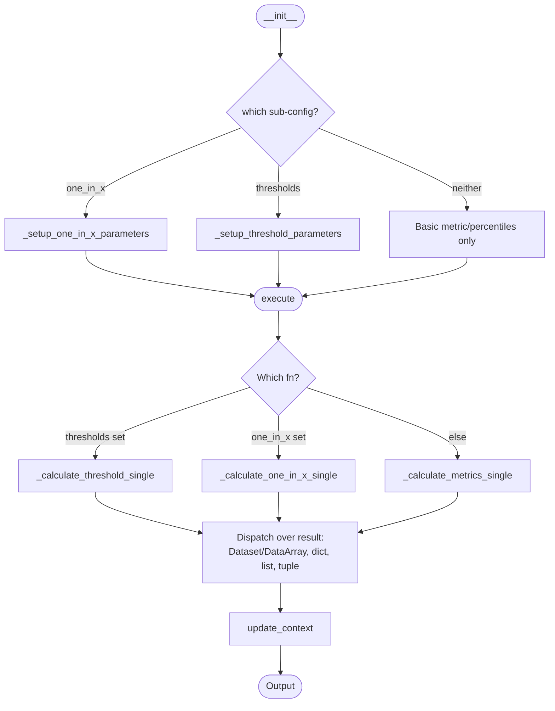
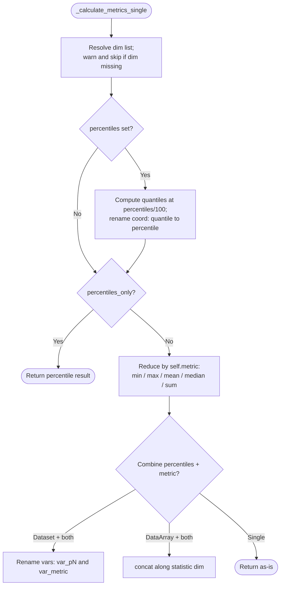
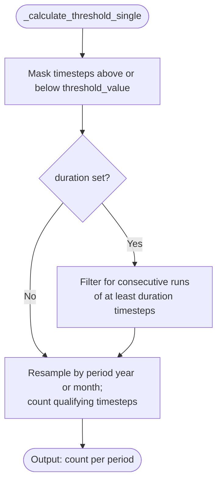
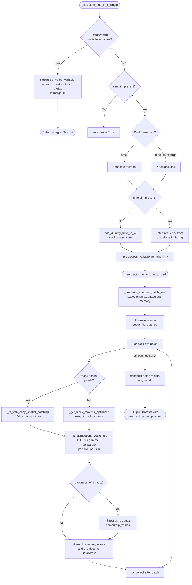

# Processor: MetricCalc

**Registry key:** `metric_calc` &nbsp;|&nbsp; **Priority:** 7500 &nbsp;|&nbsp; **Category:** Analysis & Derived Variables

Reduce a dataset along one or more dimensions using a basic statistic (`min` / `max` / `mean` / `median` / `sum`), optionally compute percentiles alongside it, count threshold exceedances, or fit extreme-value distributions to estimate return periods.

## Three calculation modes

`__init__` reads the value dict and chooses a mode at execute time based on which sub-config is present:

| Mode | Triggered by | Output |
|------|--------------|--------|
| **Basic / percentiles** | neither `thresholds` nor `one_in_x` | reduced Dataset/DataArray; if both metric and percentiles are requested for a Dataset, variables are renamed `<var>_p<N>` and `<var>_<metric>` |
| **Threshold exceedance** | `thresholds={...}` | counts of qualifying timesteps per period |
| **1-in-X extreme value** | `one_in_x={...}` | `return_values` and `p_values` (KS goodness-of-fit) |

> The earlier doc used the key `one_in_x_config`. The actual key is **`one_in_x`** (`__init__` calls `value.get("one_in_x", UNSET)`). Earlier doc also listed metrics like `hdd_cdd`, `heat_index`, `effective_temp`, `noaa_heat_index` — those live in `climakitae.tools.indices` / `derived_variables`, not in this processor. The supported `metric` values here are exactly `min`, `max`, `mean` (default), `median`, `sum`.

## Algorithm



### Basic / percentiles flow



### Threshold flow (`_calculate_threshold_single`)



`thresholds` config keys (validated in `_setup_threshold_parameters`):

| Key | Type | Default | Notes |
|-----|------|---------|-------|
| `threshold_value` | float | required | Comparison value (in data units). |
| `threshold_direction` | `"above"` / `"below"` | required | |
| `period` | `(int, str)` | `(1, "year")` | Aggregation period; unit must be `"year"` or `"month"`. |
| `duration` | optional | `UNSET` | Minimum consecutive timesteps qualifying as an event. |

Cannot be combined with `metric`, `percentiles`, or `one_in_x`.

### 1-in-X flow (`_calculate_one_in_x_single`)



`one_in_x` config keys (validated in `_setup_one_in_x_parameters`):

| Key | Type | Default | Notes |
|-----|------|---------|-------|
| `return_periods` | array-like | one of these | Periods to compute (mutually exclusive with `return_values`). |
| `return_values` | array-like | one of these | Pre-set values to compute exceedance probabilities for. |
| `distribution` | str | `"gev"` | `"gev"`, `"gamma"`, `"genpareto"`. |
| `extremes_type` | `"max"` / `"min"` | `"max"` | |
| `event_duration` | `(int, str)` | `(1, "day")` | Block duration. |
| `grouped_duration` | optional | `UNSET` | |
| `block_size` | int | `1` | |
| `goodness_of_fit_test` | bool | `True` | KS test on residuals. |
| `print_goodness_of_fit` | bool | `True` | |
| `variable_preprocessing` | dict | `{}` | Preprocessing config. |

Internally the workflow extracts block extrema, fits the chosen distribution, and produces `return_values` plus `p_values` (KS p-value) DataArrays. Heavy lifting is in the vectorized helpers listed under [Code References](#code-references).

## Top-level parameters (basic mode)

| Key | Type | Default | Description |
|-----|------|---------|-------------|
| `metric` | str | `"mean"` | `"min"`, `"max"`, `"mean"`, `"median"`, `"sum"`. |
| `percentiles` | list[float] | `UNSET` | Percentile values 0–100; output stored on coord `percentile`. |
| `percentiles_only` | bool | `False` | Skip the metric reduction. |
| `dim` (or `dims`) | str / list[str] | `"time"` | Dimensions to reduce over. Missing dims are filtered with a warning. |
| `keepdims` | bool | `False` | (Reserved; passed through where supported.) |
| `skipna` | bool | `True` | Pass to underlying xarray reductions. |

## Examples

### Basic mean + percentiles

```python
data = (ClimateData()
    .catalog("cadcat").activity_id("WRF").institution_id("UCLA")
    .variable("t2max").table_id("day").grid_label("d03")
    .processes({
        "time_slice": ("2015-01-01", "2015-12-31"),
        "metric_calc": {
            "metric": "mean",
            "percentiles": [10, 50, 90],
            "dim": "time",
        },
    })
    .get())
# Dataset variables: t2max_p10, t2max_p50, t2max_p90, t2max_mean
```

### Threshold exceedance (annual count of days above 35 °C, 3-day events)

```python
.processes({
    "metric_calc": {
        "thresholds": {
            "threshold_value": 35.0,
            "threshold_direction": "above",
            "period": (1, "year"),
            "duration": 3,
        }
    }
})
```

### 1-in-X return periods

```python
.processes({
    "metric_calc": {
        "one_in_x": {
            "return_periods": [2, 5, 10, 20, 50, 100],
            "distribution": "gev",
            "extremes_type": "max",
            "event_duration": (1, "year"),
            "block_size": 1,
        }
    }
})
```

## Code References

| Method | Lines | Purpose |
|--------|-------|---------|
| `__init__` | [145–189](https://github.com/cal-adapt/climakitae/blob/main/climakitae/new_core/processors/metric_calc.py#L145) | Parse top-level + dispatch sub-config setup |
| `_setup_one_in_x_parameters` | [191–260](https://github.com/cal-adapt/climakitae/blob/main/climakitae/new_core/processors/metric_calc.py#L191) | Validate periods/values, set distribution & defaults |
| `_setup_threshold_parameters` | [262–303](https://github.com/cal-adapt/climakitae/blob/main/climakitae/new_core/processors/metric_calc.py#L262) | Validate threshold dict, normalize period tuple |
| `execute` | [305–370](https://github.com/cal-adapt/climakitae/blob/main/climakitae/new_core/processors/metric_calc.py#L305) | Pick `process_fn`, dispatch over result type |
| `_calculate_metrics_single` | [372–510](https://github.com/cal-adapt/climakitae/blob/main/climakitae/new_core/processors/metric_calc.py#L372) | Quantile + min/max/mean/median/sum reductions |
| `_calculate_threshold_single` | [512–593](https://github.com/cal-adapt/climakitae/blob/main/climakitae/new_core/processors/metric_calc.py#L512) | Threshold mask, optional duration filter, resample-sum |
| `_calculate_one_in_x_single` | [595–720](https://github.com/cal-adapt/climakitae/blob/main/climakitae/new_core/processors/metric_calc.py#L595) | Drives 1-in-X analysis per simulation |
| `_fit_return_variable_1d` | [722–848](https://github.com/cal-adapt/climakitae/blob/main/climakitae/new_core/processors/metric_calc.py#L722) | Per-pixel distribution fit |
| `_calculate_one_in_x_vectorized` | [850–927](https://github.com/cal-adapt/climakitae/blob/main/climakitae/new_core/processors/metric_calc.py#L850) | Vectorized fit pathway |
| `_calculate_adaptive_batch_size` | [929–1037](https://github.com/cal-adapt/climakitae/blob/main/climakitae/new_core/processors/metric_calc.py#L929) | Pick spatial batch size from dataset shape |
| `_process_simulation_batch` | [1039–1165](https://github.com/cal-adapt/climakitae/blob/main/climakitae/new_core/processors/metric_calc.py#L1039) | Run one batch through the fit pipeline |
| `_fit_distributions_vectorized` | [1167–1214](https://github.com/cal-adapt/climakitae/blob/main/climakitae/new_core/processors/metric_calc.py#L1167) | NumPy-vectorized fitting |
| `_fit_with_early_spatial_batching` | [1216–1346](https://github.com/cal-adapt/climakitae/blob/main/climakitae/new_core/processors/metric_calc.py#L1216) | Memory-aware spatial batching |
| `_preprocess_variable_for_one_in_x` | [1348–1385](https://github.com/cal-adapt/climakitae/blob/main/climakitae/new_core/processors/metric_calc.py#L1348) | Apply user-supplied preprocessing |
| `update_context` | [1387–](https://github.com/cal-adapt/climakitae/blob/main/climakitae/new_core/processors/metric_calc.py#L1387) | Tag `new_attrs` with computed metric metadata |

## See also

- [Processor index](index.md)
- [`climakitae/new_core/processors/metric_calc.py`](https://github.com/cal-adapt/climakitae/blob/main/climakitae/new_core/processors/metric_calc.py)
- For HDD/CDD, heat index, etc., see `climakitae.tools.indices` and `climakitae.tools.derived_variables` (separate modules, not invoked by `metric_calc`).
