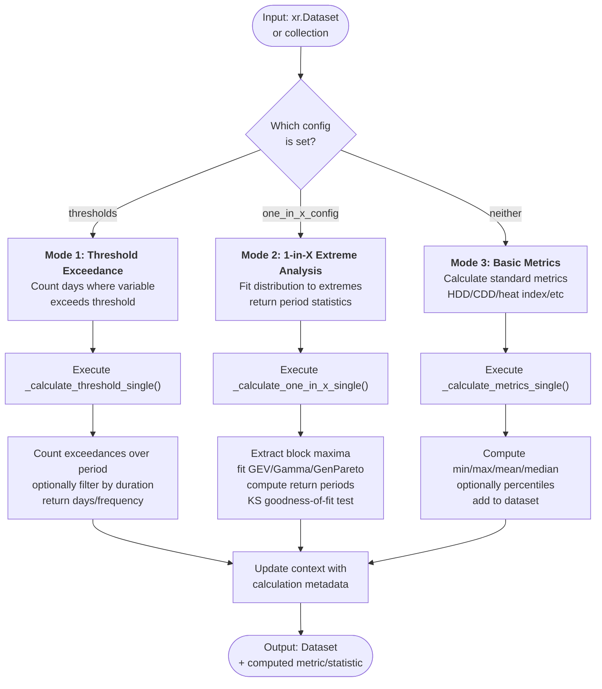
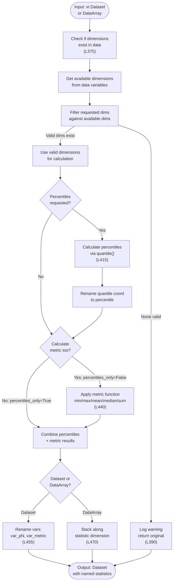
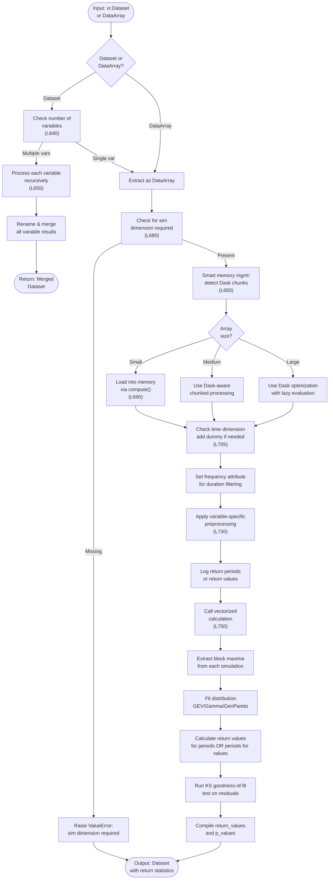

# Processor: MetricCalc

**Registry key:** `metric_calc` &nbsp;|&nbsp; **Priority:** 7500 &nbsp;|&nbsp; **Category:** Analysis & Derived Variables

Compute derived climate metrics and indices from base variables. Calculate heating/cooling degree days, heat indices, extreme event frequencies, threshold exceedance days, and return period statistics via extreme value distribution fitting.

## Algorithm

The processor has **three distinct calculation modes** selected by parameters:



## Detailed Mode Workflows

### Mode 1: Basic Metrics Calculation Flow



### Mode 2: Threshold Exceedance Flow

```mermaid
flowchart TD
    Start2([Input: xr.Dataset<br/>or DataArray]) --> AddTime["Check for time dim<br/>add dummy if missing<br/>(L540)"]
    
    AddTime --> DefApply["Define _apply function<br/>for each variable"]
    
    DefApply --> ThreshComp["Create threshold mask:<br/>above/below comparison<br/>(L555)"]
    
    ThreshComp --> PreserveNaN["Preserve NaNs in mask<br/>using where not null"]
    
    PreserveNaN --> CheckDur{Duration<br/>filter?}
    
    CheckDur -->|No| CountExceed
    CheckDur -->|Yes| ConvertDur["Convert duration tuple<br/>to timestep count<br/>(L565)"]
    
    ConvertDur --> GetFreq["Get data frequency<br/>from attrs"]
    GetFreq --> CalcSteps["Map unit+frequency<br/>to n_steps"]
    
    CalcSteps --> RollingFilter["Apply rolling min<br/>for consecutive days<br/>(L585)"]
    
    RollingFilter --> CountExceed["Resample by period<br/>and sum exceedances<br/>(L590)"]
    
    CountExceed --> MinCount["Use min_count=1<br/>to preserve NaN vs 0"]
    
    MinCount --> ReturnDataset{Dataset or<br/>DataArray?}
    
    ReturnDataset -->|DataArray| Wrap["Wrap in Dataset<br/>with var name"]
    ReturnDataset -->|Dataset| LoopVars["Loop apply()<br/>over all variables<br/>(L597)"]
    
    Wrap --> End2([Output: Dataset<br/>with exceedance counts])
    LoopVars --> End2
    
    click AddTime "https://github.com/cal-adapt/climakitae/blob/main/climakitae/new_core/processors/metric_calc.py#L540" "Check/add time"
    click ThreshComp "https://github.com/cal-adapt/climakitae/blob/main/climakitae/new_core/processors/metric_calc.py#L555" "Threshold comparison"
    click ConvertDur "https://github.com/cal-adapt/climakitae/blob/main/climakitae/new_core/processors/metric_calc.py#L565" "Convert duration"
    click RollingFilter "https://github.com/cal-adapt/climakitae/blob/main/climakitae/new_core/processors/metric_calc.py#L585" "Rolling filter"
    click CountExceed "https://github.com/cal-adapt/climakitae/blob/main/climakitae/new_core/processors/metric_calc.py#L590" "Resample & count"
    click LoopVars "https://github.com/cal-adapt/climakitae/blob/main/climakitae/new_core/processors/metric_calc.py#L597" "Loop over variables"
```



### Mode 3: 1-in-X Extreme Value Analysis Flow



## Calculation Modes

### Mode 1: Basic Metrics (Default)
Calculate standard climate summary statistics when `metric` is specified.

**Supported Metrics:**
- `hdd_cdd`: Heating/Cooling degree days (threshold-based)
- `heat_index`: Combined heat stress (temperature + humidity)
- `effective_temp`: Exponentially smoothed temperature for energy models
- `noaa_heat_index`: NOAA heat index (NWS formula)
- Custom metrics via `climakitae.tools.indices`

**Output:** Dataset with new variable (e.g., `hdd`, `cdd`, `heat_index`)

### Mode 2: Threshold Exceedance
Count days where a variable exceeds (or falls below) a threshold, optionally filtered by consecutive-day duration.

**Configuration:** `thresholds` dictionary with:
- `threshold_value`: Numeric threshold (e.g., 95 for 95°F)
- `threshold_direction`: "above" or "below"
- `period`: Time period for aggregation ("yearly", "monthly", "seasonal")
- `duration`: Optional minimum consecutive days for event filtering

**Output:** Dataset with exceedance count variable (e.g., `days_above_95F`)

**Use Cases:**
- Heat wave frequency (consecutive days above threshold)
- Frost occurrence analysis (days below freezing)
- Precipitation extremes (rain days above 50mm)

### Mode 3: 1-in-X Extreme Value Analysis ⚠️ Advanced
Fit statistical distributions to climate extremes and compute return period statistics. Uses block maxima extraction and statistical distribution fitting (GEV, Gamma, Generalized Pareto).

**Configuration:** `one_in_x_config` dictionary with:
- `return_periods`: List of return periods (e.g., [2, 5, 10, 20, 50, 100]) **OR**
- `return_values`: Pre-defined return values to calculate probabilities for
- `distribution`: "gev", "gamma", "genpareto" (default: "gev")
- `extremes_type`: "max" or "min" (default: "max")
- `event_duration`: Duration for block maxima extraction (days/months/years)
- `block_size`: Block size for GEV fitting (default: 365 for annual blocks)
- `goodness_of_fit_test`: "ks" for Kolmogorov-Smirnov test (default: "ks")
- `variable_preprocessing`: Data preprocessing before fitting

**Output:** Dataset with `return_values` and `p_values` (KS test p-value) variables

**Scientific Details:**
- Extreme value theory provides probabilities for rare events beyond observed data
- GEV (Generalized Extreme Value) distribution: Standard for climate extremes
- Block Maxima Approach: Extract maximum/minimum from fixed time blocks
- Goodness-of-fit testing: KS test validates distribution fit quality
- Returns both estimated values and uncertainty via p-values

**Use Cases:**
- Estimate 100-year temperature events from 30 years of data
- Characterize tail behavior of precipitation distributions
- Infrastructure design (what's the 1-in-500-year storm?)
- Climate change impacts (return period shifts between scenarios)

## Supported Metrics Reference

| Metric | Variables Required | Periods | Return Type |
|--------|-------------------|---------|-------------|
| `hdd_cdd` | tasmax, tasmin | yearly, seasonal, monthly | New vars: hdd, cdd (days) |
| `heat_index` | tasmax, humidity | any | New var: heat_index (°C) |
| `effective_temp` | tasmax | any | New var: effective_temp (°C) |
| `noaa_heat_index` | tasmax, humidity | any | New var: heat_index_noaa (°C) |
| Threshold exceedance | any numeric | yearly, monthly, seasonal | New var: exceedance_count (days) |
| Extreme value fit | tasmax/tasmin/pr | N/A | New vars: return_values, p_values |

## Parameters

| Parameter | Type | Mode(s) | Description |
|-----------|------|---------|-------------|
| `metric` | str | Mode 1 | Metric name (hdd_cdd, heat_index, etc.) |
| `percentiles` | list | Mode 1 | Optional percentile values (e.g., [5, 25, 50, 75, 95]) |
| `percentiles_only` | bool | Mode 1 | If True, return only percentiles (skip min/max/mean) |
| `dim` | str/list | Modes 1–3 | Dimensions to compute over (e.g., "time", ["lat", "lon"]) |
| `keepdims` | bool | Modes 1–3 | If True, keep reduced dimensions as size 1 |
| `skipna` | bool | Modes 1–3 | If True, skip NaN values in calculations |
| **Threshold Mode (2)** | | | |
| `threshold_value` | float | Mode 2 | Threshold for comparison |
| `threshold_direction` | str | Mode 2 | "above" or "below" |
| `period` | str | Mode 2 | "yearly", "monthly", "seasonal" |
| `duration` | int | Mode 2 | Optional: minimum consecutive days for event |
| **Extreme Value Mode (3)** | | | |
| `return_periods` | list[int] | Mode 3 | Return periods to compute (e.g., [2, 5, 10, 20, 100]) |
| `return_values` | list[float] | Mode 3 | Pre-defined values for probability estimation |
| `distribution` | str | Mode 3 | "gev", "gamma", or "genpareto" |
| `extremes_type` | str | Mode 3 | "max" or "min" |
| `event_duration` | str | Mode 3 | "day", "month", "year" for block extraction |
| `block_size` | int | Mode 3 | Number of time units per block |
| `goodness_of_fit_test` | str | Mode 3 | "ks" for Kolmogorov-Smirnov test |
| `variable_preprocessing` | dict | Mode 3 | Data preprocessing config |

## Examples

### Mode 1: Basic Metrics (HDD/CDD)

```python
from climakitae.new_core.user_interface import ClimateData

# Compute heating/cooling degree days (65°F threshold)
data = (ClimateData()
    .catalog("cadcat")
    .activity_id("WRF")
    .variable("t2max")
    .table_id("day")
    .grid_label("d03")
    .processes({
        "time_slice": ("2015-01-01", "2015-12-31"),
        "metric_calc": {
            "metric": "hdd_cdd",
            "percentiles": [10, 50, 90],  # Optional: include percentiles
            "keepdims": False
        }
    })
    .get())

# Result: Dataset with variables hdd (heating degree days) and cdd (cooling degree days)
```

### Mode 2: Threshold Exceedance

```python
# Count consecutive days with temperature above 95°F (35°C)
data = (ClimateData()
    .catalog("cadcat")
    .activity_id("WRF")
    .variable("t2max")
    .table_id("day")
    .grid_label("d03")
    .processes({
        "time_slice": ("2015-01-01", "2015-12-31"),
        "metric_calc": {
            "thresholds": {
                "threshold_value": 95,
                "threshold_direction": "above",
                "period": "yearly",
                "duration": 3  # At least 3 consecutive days
            }
        }
    })
    .get())

# Result: Dataset with variable days_above_95F (count of qualifying events)
```

### Mode 3: 1-in-X Extreme Value Analysis

```python
# Estimate 100-year return period temperatures
# Uses GEV distribution fit to annual maxima
data = (ClimateData()
    .catalog("cadcat")
    .activity_id("WRF")
    .variable("t2max")
    .table_id("day")
    .grid_label("d03")
    .processes({
        "time_slice": ("1995-01-01", "2024-12-31"),  # 30 years of data
        "metric_calc": {
            "one_in_x_config": {
                "return_periods": [2, 5, 10, 20, 50, 100],
                "distribution": "gev",
                "extremes_type": "max",
                "event_duration": "year",
                "block_size": 365,
                "goodness_of_fit_test": "ks"
            }
        }
    })
    .get())

# Result: Dataset with variables:
# - return_values: Estimated temperature for each return period
# - p_values: Kolmogorov-Smirnov test p-values (>0.05 indicates good fit)
```

### Mode 1: Heat Index (Temperature + Humidity)

```python
# Compute NOAA heat index when both temperature and humidity available
data = (ClimateData()
    .catalog("cadcat")
    .activity_id("WRF")
    .variable("t2max")
    .table_id("day")
    .grid_label("d02")
    .processes({
        "metric_calc": {
            "metric": "noaa_heat_index",
            "dim": "time",  # Compute over time dimension
            "skipna": True
        }
    })
    .get())

# Result: Dataset with heat_index_noaa variable
```

## Code References

| Method | Lines | Purpose |
|--------|-------|---------|
| `__init__` | [50–260](https://github.com/cal-adapt/climakitae/blob/main/climakitae/new_core/processors/metric_calc.py#L50) | Parse metric/threshold/extreme configs |
| `execute` | [310–360](https://github.com/cal-adapt/climakitae/blob/main/climakitae/new_core/processors/metric_calc.py#L310) | Route to appropriate calculation mode |
| `_calculate_metrics_single` | [370–510](https://github.com/cal-adapt/climakitae/blob/main/climakitae/new_core/processors/metric_calc.py#L370) | Mode 1: basic metrics/percentiles |
| `_calculate_threshold_single` | [520–595](https://github.com/cal-adapt/climakitae/blob/main/climakitae/new_core/processors/metric_calc.py#L520) | Mode 2: threshold exceedance counting |
| `_calculate_one_in_x_single` | [600–740](https://github.com/cal-adapt/climakitae/blob/main/climakitae/new_core/processors/metric_calc.py#L600) | Mode 3: extreme value distribution fitting |
| `_fit_return_variable_1d` | [750–850](https://github.com/cal-adapt/climakitae/blob/main/climakitae/new_core/processors/metric_calc.py#L750) | GEV/Gamma/GenPareto fitting with KS test |

## Performance Notes

- **Mode 1 (Metrics):** Fast, 100x100 grid ~100ms
- **Mode 2 (Thresholds):** Fast, depends on duration filtering
- **Mode 3 (Extreme Value):** Slow, distribution fitting is I/O-bound. ~50-100s for 100x100 grid
- Use `dask.compute()` for large spatial domains with Mode 3

## See Also

- [Processor Index](index.md)
- [climakitae.tools.indices](https://github.com/cal-adapt/climakitae/blob/main/climakitae/tools/indices.py)
- [climakitae.tools.derived_variables](https://github.com/cal-adapt/climakitae/blob/main/climakitae/tools/derived_variables.py)
- [How-To Guides → Derived Variables](../howto.md#derived-variables)
- [Extreme Value Theory](https://en.wikipedia.org/wiki/Extreme_value_theory)
