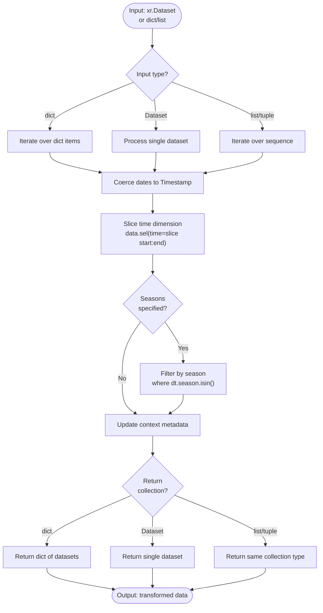

# Processor: TimeSlice

**Registry key:** `time_slice` &nbsp;|&nbsp; **Priority:** 150 &nbsp;|&nbsp; **Category:** Temporal Processing

Subset climate data by date range and optional seasonal filters. Apply calendar-based temporal windowing to extract specific time periods or seasons from multi-year datasets.

## Algorithm



### Execution Flow

1. **Initialization** (lines 52–73): Parse dates parameter (tuple or dict), coerce to pandas Timestamps via `_coerce_to_dates`, store optional seasons
2. **Input Routing** (lines 108–129): `match` statement dispatches on `dict` / `xr.Dataset|DataArray` / `list|tuple`; unsupported types log a warning at line 127
3. **Time Slicing** (line 162): `obj.sel(time=slice(self.value[0], self.value[1]))`
4. **Season Filtering** (lines 163–164): If `self.seasons is not UNSET`, apply `where(obj.time.dt.season.isin(self.seasons), drop=True)`
5. **Context Update** (lines 131–151): `update_context` records the operation under `context["new_attrs"]["time_slice"]`
6. **Return**: Same container type as input (dict / Dataset|DataArray / list|tuple)

## Parameters

| Parameter | Type | Required | Default | Description | Constraints |
|-----------|------|----------|---------|-------------|-------------|
| `value` | tuple or dict | ✓ | — | Date range specification | See examples below |
| `dates` | (date_like, date_like) | ✓ (if dict) | — | Start and end dates for slice | Timestamps, date strings, or year integers |
| `seasons` | str or list | | UNSET | Season(s) to filter | "DJF", "MAM", "JJA", "SON" or list thereof |

### Date Formats

Accepted date formats (coerced to pandas Timestamp):

```python
# Year only — interpreted as Jan 1 to Dec 31
("2015", "2015")  # Full year 2015

# Year-month
("2015-01", "2015-12")  # Jan 2015 to Dec 2015

# Full ISO date
("2015-01-01", "2015-12-31")  # Exact range

# Pandas Timestamp objects
(pd.Timestamp("2015-01-01"), pd.Timestamp("2015-12-31"))

# Mixed formats
("2015", "2015-06-30")  # Jan 1, 2015 to June 30, 2015
```

### Seasons

Valid season codes (climatological):

- **DJF** — December, January, February (winter)
- **MAM** — March, April, May (spring)
- **JJA** — June, July, August (summer)
- **SON** — September, October, November (fall)

## Code References

| Method | Lines | Purpose |
|--------|-------|---------|
| `__init__` | [52–73](https://github.com/cal-adapt/climakitae/blob/main/climakitae/new_core/processors/time_slice.py#L52) | Parse and normalize `value`/`dates`/`seasons` |
| `execute` | [76–129](https://github.com/cal-adapt/climakitae/blob/main/climakitae/new_core/processors/time_slice.py#L76) | Route by input type and apply slicing |
| `update_context` | [131–151](https://github.com/cal-adapt/climakitae/blob/main/climakitae/new_core/processors/time_slice.py#L131) | Record operation metadata |
| `set_data_accessor` | [153–155](https://github.com/cal-adapt/climakitae/blob/main/climakitae/new_core/processors/time_slice.py#L153) | No-op placeholder (interface compliance) |
| `_subset_time_and_season` | [157–165](https://github.com/cal-adapt/climakitae/blob/main/climakitae/new_core/processors/time_slice.py#L157) | Core xarray `.sel` + season `.where` logic |

## Examples

### Basic Time Slice (Date Range)

```python
from climakitae.new_core.user_interface import ClimateData

# Full year 2015
data = (ClimateData()
    .catalog("cadcat")
    .activity_id("WRF")
    .variable("t2max")
    .table_id("day")
    .grid_label("d03")
    .processes({
        "time_slice": ("2015-01-01", "2015-12-31")
    })
    .get())
```

### With Seasonal Filter

```python
# Extract summer (JJA) from 2015
data = (ClimateData()
    .catalog("cadcat")
    .activity_id("WRF")
    .variable("t2max")
    .table_id("day")
    .grid_label("d03")
    .processes({
        "time_slice": {
            "dates": ("2015-01-01", "2015-12-31"),
            "seasons": "JJA"
        }
    })
    .get())
```

### Multiple Seasons

```python
# Extract shoulder seasons (spring + fall) from 2010–2020
data = (ClimateData()
    .catalog("cadcat")
    .activity_id("WRF")
    .variable("pr")
    .table_id("mon")
    .grid_label("d02")
    .processes({
        "time_slice": {
            "dates": ("2010-01-01", "2020-12-31"),
            "seasons": ["MAM", "SON"]  # Spring and fall only
        }
    })
    .get())
```

### Chained with Other Processors

```python
# Full pipeline: subset time + clip region + export
data = (ClimateData()
    .catalog("cadcat")
    .activity_id("WRF")
    .variable("t2max")
    .table_id("day")
    .grid_label("d03")
    .processes({
        "time_slice": ("2020-06-01", "2020-08-31"),  # Summer only
        "clip": "Los Angeles County",
        "export": {
            "filename": "la_summer_2020",
            "file_format": "NetCDF"
        }
    })
    .get())
```

## Implementation Details

### Data Type Handling

TimeSlice handles three input patterns:

1. **Single Dataset**: Direct slicing and return
   ```python
   result = dataset.sel(time=slice(start, end))
   ```

2. **Dict** (from `separated` clipping): Slice each value, preserve keys
   ```python
   result = {key: ds.sel(time=slice(start, end)) for key, ds in input.items()}
   ```

3. **List/Tuple** (multi-point outputs): Slice each item, preserve container type
   ```python
   result = [ds.sel(time=slice(start, end)) for ds in input]
   ```

### Date Coercion

The `_coerce_to_dates()` helper (imported from param_validation) handles flexible date input:

- Parses strings using pandas datetime parser (ISO 8601 support)
- Converts year-only inputs to full calendar year (e.g., "2015" → "2015-01-01")
- Validates start ≤ end

### Season Filtering

Seasons use xarray's built-in `dt.season` accessor:

```python
# Filter to JJA (summer) only
summer = data.where(data.time.dt.season.isin(["JJA"]), drop=True)
```

The `drop=True` removes any time steps outside the selected seasons.

### Lazy Evaluation

TimeSlice preserves dask lazy evaluation — the `.sel()` and `.where()` operations are lazy and computed only when `.compute()` is called or data is exported.

### Context Metadata

Operation is recorded with full parameter details:

```json
{
  "new_attrs": {
    "time_slice": "Process 'time_slice' applied to the data. Slicing was done using the following value: (Timestamp('2015-01-01 00:00:00'), Timestamp('2015-12-31 00:00:00'))."
  }
}
```

This is attached to `result.attrs["history"]` or similar in exported files.

## Common Patterns

### Extract Specific Months

```python
# January through March (Q1)
data = (ClimateData()
    .catalog("cadcat")
    .activity_id("WRF")
    .variable("pr")
    .table_id("day")
    .grid_label("d03")
    .processes({
        "time_slice": {
            "dates": ("2020-01-01", "2020-03-31")
        }
    })
    .get())
```

### Annual Trend Analysis

```python
# Loop over multiple years
years = range(2000, 2021)
datasets = {}

for year in years:
    start = f"{year}-01-01"
    end = f"{year}-12-31"
    datasets[year] = (ClimateData()
        .catalog("cadcat")
        .activity_id("WRF")
        .variable("t2max")
        .table_id("mon")
        .grid_label("d03")
        .processes({"time_slice": (start, end)})
        .get())
```

### Interannual Variability (Same Season, Multiple Years)

```python
# Summer temperature anomaly: JJA from 2010–2020
data = (ClimateData()
    .catalog("cadcat")
    .activity_id("WRF")
    .variable("t2max")
    .table_id("day")
    .grid_label("d02")
    .processes({
        "time_slice": {
            "dates": ("2010-01-01", "2020-12-31"),
            "seasons": "JJA"
        }
    })
    .get())

# Now data contains only June-August data from 2010–2020
# Group and compute anomalies
anomaly = data.groupby("time.year").mean("time")
```

## See Also

- [Processor Index](index.md)
- [Warming Level Processor](warming_level.md) — Alternative temporal subsetting by climate scenario
- [Architecture → Extension Guide](../architecture.md#add-a-processor-4-step-guide)
- [How-To Guides → Time-Based Queries](../howto.md#time-based-queries)
