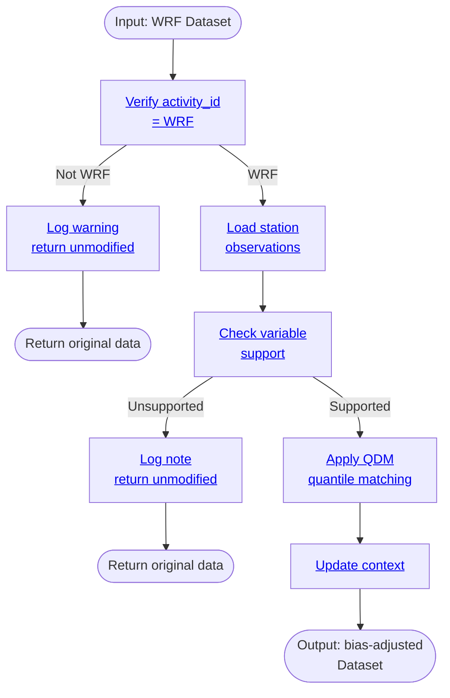

# Processor: BiasAdjustModelToStation

**Priority:** 240 | **Category:** Data Refinement

Apply bias correction to WRF model data using quantile delta mapping (QDM) with weather station observations. Reduce systematic errors between model simulations and observed climate.

## Algorithm



## Parameters

| Parameter | Type | Description |
|-----------|------|-------------|
| `stations` | list | Station codes (e.g., ["KSAC", "KSFO"]) |

## Requirements

- **Activity ID**: Must be "WRF" (dynamical downscaling)
- **Variables**: Currently supports `t2` (hourly temperature)
- **Data**: Must span sufficient historical period for QDM training

## Examples

```python
from climakitae.new_core.user_interface import ClimateData

# Bias-correct WRF data at Sacramento observation point
data = (ClimateData()
    .catalog("cadcat")
    .activity_id("WRF")
    .variable("t2")
    .table_id("1hr")
    .grid_label("d03")
    .processes({
        "bias_adjust_model_to_station": {
            "stations": ["KSAC"]
        }
    })
    .get())
```

## See Also

- [Processor Index](index.md)
- [How-To Guides → Bias Correction](../howto.md#bias-correction-station-localization)
- [Architecture → Bias Correction](../architecture.md#bias-correction)
