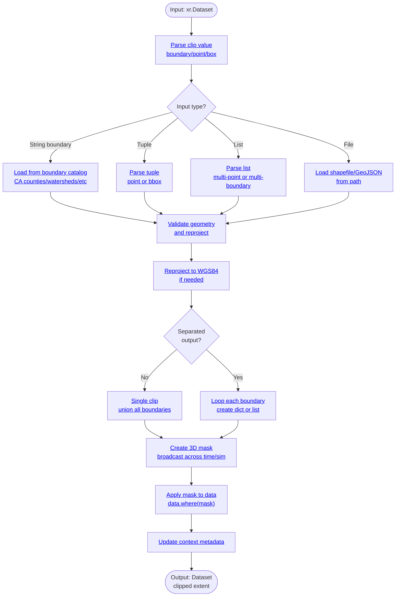

# Processor: Clip

**Priority:** 200 | **Category:** Spatial Processing

Subset climate data to specific geographic regions, points, or boundaries. Extract data for counties, watersheds, weather stations, or custom lat/lon coordinates with automatic coordinate system handling.

## Algorithm



### Execution Flow

1. **Parse Input** (lines 95–115): Determine clip value type (boundary name, point, bounding box, file path)
2. **Load Geometry** (lines 120–190): Load boundary from catalog or shapefile
3. **Validate & Reproject** (lines 200–220): Ensure WGS84, check for empty/invalid geometries
4. **Check Separation** (lines 225–250): Determine if output should be single dataset or dict/list
5. **Create Mask** (lines 260–270): Convert geometry to 3D boolean mask with xarray `.rio` accessor
6. **Apply Mask** (lines 275–285): Mask data with `data.where(mask, drop=False)`
7. **Update Context** (lines 290–300): Record clipped region in attributes
8. **Return** (type matches input): dict/list/Dataset based on separation parameter

## Parameters

| Parameter | Type | Required | Default | Description | Constraints |
|-----------|------|----------|---------|-------------|-------------|
| `value` | str/tuple/list/dict | ✓ | — | Geometry specification | See examples; can be combined |
| `separated` | bool | | False | Return separate datasets per boundary/point | True for dict/list output |
| `location_based_naming` | bool | | False | Use lat/lon in filenames (with export) | Only applies with separated=True |

### Input Formats

**Named Boundary** (string):
```python
"Los Angeles"      # County name
"San Francisco Bay Watershed"
"CA"              # State-wide
```

**Single Point** (2-tuple):
```python
(37.7749, -122.4194)  # (lat, lon)
```

**Bounding Box** (2-tuple of tuples):
```python
((36.0, 39.0), (-122.0, -118.0))  # ((lat_min, lat_max), (lon_min, lon_max))
```

**Multiple Points** (list of tuples):
```python
[(34.05, -118.25), (37.77, -122.42), (32.72, -117.16)]
```

**Multiple Boundaries** (list of strings):
```python
["Alameda", "Contra Costa", "Santa Clara"]
```

**Weather Station** (string code):
```python
"KSAC"  # Sacramento International
"KSFO"  # San Francisco
```

## Code References

| Method | Lines | Purpose |
|--------|-------|---------|
| `__init__` | [85–110](https://github.com/cal-adapt/climakitae/blob/main/climakitae/new_core/processors/clip.py#L85) | Parse and store clip parameters |
| `execute` | [115–165](https://github.com/cal-adapt/climakitae/blob/main/climakitae/new_core/processors/clip.py#L115) | Route input type and apply clipping |
| `_get_boundary_geometry` | [170–220](https://github.com/cal-adapt/climakitae/blob/main/climakitae/new_core/processors/clip.py#L170) | Load geometry from sources |
| `_clip_data_with_geom` | [225–270](https://github.com/cal-adapt/climakitae/blob/main/climakitae/new_core/processors/clip.py#L225) | Core rioxarray masking logic |
| `update_context` | [280–295](https://github.com/cal-adapt/climakitae/blob/main/climakitae/new_core/processors/clip.py#L280) | Record clipped region metadata |

## Examples

### Single County

```python
from climakitae.new_core.user_interface import ClimateData

data = (ClimateData()
    .catalog("cadcat")
    .activity_id("WRF")
    .variable("t2max")
    .table_id("day")
    .grid_label("d03")
    .processes({
        "clip": "Alameda"
    })
    .get())
```

### Multiple Counties (Separated)

```python
# Get each county in separate dataset
data = (ClimateData()
    .catalog("cadcat")
    .activity_id("WRF")
    .variable("pr")
    .table_id("mon")
    .grid_label("d02")
    .processes({
        "clip": {
            "boundaries": ["Alameda", "Contra Costa", "Santa Clara"],
            "separated": True
        }
    })
    .get())

# data is dict: {"Alameda": ds1, "Contra Costa": ds2, "Santa Clara": ds3}
```

### Single Lat/Lon Point

```python
# Closest grid cell to San Francisco
data = (ClimateData()
    .catalog("cadcat")
    .activity_id("WRF")
    .variable("t2max")
    .table_id("day")
    .grid_label("d03")
    .processes({
        "clip": (37.7749, -122.4194)
    })
    .get())

# Scalar lat/lon coordinates (size 1)
```

### Multiple Points (Separated)

```python
# Time series for 3 cities
locations = [
    (34.05, -118.25),    # Los Angeles
    (37.77, -122.42),    # San Francisco
    (32.72, -117.16)     # San Diego
]

data = (ClimateData()
    .catalog("cadcat")
    .activity_id("WRF")
    .variable("t2max")
    .table_id("day")
    .grid_label("d03")
    .processes({
        "clip": {
            "boundaries": locations,
            "separated": True,
            "location_based_naming": True
        }
    })
    .get())

# data is dict with lat/lon in keys
```

### Bounding Box

```python
# Bay Area region (rough bbox)
data = (ClimateData()
    .catalog("cadcat")
    .activity_id("WRF")
    .variable("pr")
    .table_id("mon")
    .grid_label("d03")
    .processes({
        "clip": ((37.5, 38.5), (-123.0, -121.5))
    })
    .get())
```

### Weather Station

```python
# Sacramento airport observations reference point
data = (ClimateData()
    .catalog("cadcat")
    .activity_id("WRF")
    .variable("t2max")
    .table_id("day")
    .grid_label("d03")
    .processes({
        "clip": "KSAC"
    })
    .get())
```

### Chained: Clip → Warming Level → Export

```python
data = (ClimateData()
    .catalog("cadcat")
    .activity_id("WRF")
    .experiment_id("ssp245")
    .variable("t2max")
    .table_id("day")
    .grid_label("d03")
    .processes({
        "clip": "Los Angeles",
        "warming_level": {"warming_levels": [1.5, 2.0, 3.0]},
        "export": {
            "filename": "la_warming",
            "file_format": "NetCDF"
        }
    })
    .get())
```

## Implementation Details

### Geometry Loading

Clip loads from multiple sources in order:

1. **Boundary Catalog** (S3): Pre-registered CA regions (counties, watersheds, electric zones)
2. **Weather Stations** (CSV): HadISD global station metadata
3. **User Files**: Shapefiles, GeoJSON, or other OGR-supported formats

### 3D Masking

For multi-dimensional data `(time, sim, lat, lon)`, the processor broadcasts the 2D mask:

```python
mask_3d = mask.broadcast_like(data)  # Extend mask to all dims
clipped = data.where(mask_3d, drop=False)  # False keeps masked areas as NaN
```

Using `drop=False` preserves grid structure for later operations.

### Separated Output

When `separated=True`:

- **Single boundaries** → List of datasets (one per boundary)
- **Multiple points** → Dict keyed by `(lat, lon)` or index

### Error Handling

- **Invalid boundary name**: Log warning, skip or raise error
- **Empty geometry**: Return None or empty dataset
- **Out-of-bounds point**: Return nearest grid cell (clip snaps to WRF grid)

## Common Patterns

### County Loop

```python
import climakitae

counties = ["Alameda", "Contra Costa", "Santa Clara", "San Mateo"]
data_by_county = {}

for county in counties:
    data_by_county[county] = (ClimateData()
        .catalog("cadcat")
        .activity_id("WRF")
        .variable("t2max")
        .table_id("day")
        .grid_label("d03")
        .processes({"clip": county})
        .get())
```

### Urban Heat Island Study

```python
# Urban and rural points for comparison
urban_point = (37.7749, -122.4194)      # San Francisco downtown
rural_point = (37.5, -122.0)            # Sierra foothills

data = (ClimateData()
    .catalog("cadcat")
    .activity_id("WRF")
    .variable("t2max")
    .table_id("day")
    .grid_label("d03")
    .processes({
        "clip": {
            "boundaries": [urban_point, rural_point],
            "separated": True
        }
    })
    .get())

# data["urban_point"] vs data["rural_point"] comparison
```

## See Also

- [Processor Index](index.md)
- [Architecture → Spatial Subsetting](../architecture.md#spatial-subsetting)
- [How-To Guides → Clipping Data](../howto.md#clip-data)
- [CA Boundaries Reference](../concepts.md#available-boundaries)
