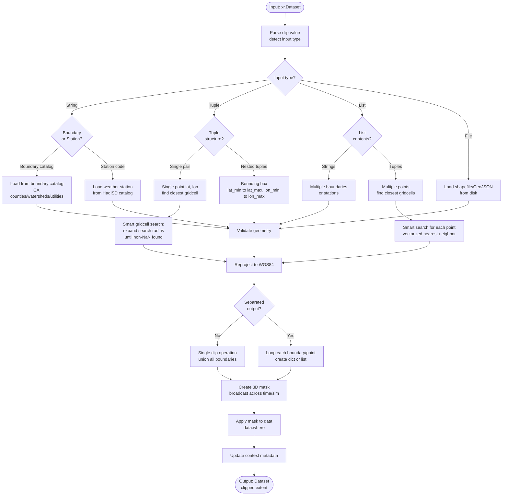

# Processor: Clip

**Priority:** 200 | **Category:** Spatial Processing

Subset climate data to specific geographic regions, points, or boundaries. Extract data for counties, watersheds, weather stations, or custom lat/lon coordinates with automatic nearest-gridcell location and coordinate system handling.

## Algorithm

The processor supports **five distinct input modes** with automatic type detection and **smart point-finding** for nearest valid gridcells:



## Input Modes

### Mode 1: Named Boundaries
Clip using predefined administrative or utility boundaries from the Cal-Adapt boundary catalog.

**Examples:**
```python
"Los Angeles"              # County name
"San Francisco Bay"        # Watershed
"CA"                       # State-wide
"CA_IOU"                   # Utility (IOU = Investor-Owned Utility)
```

### Mode 2: Weather Stations
Clip to specific weather station locations from the HadISD station network.

**Examples:**
```python
"KSAC"                     # Sacramento International Airport
"KSFO"                     # San Francisco International Airport  
"KLAX"                     # Los Angeles International Airport
```

### Mode 3: Single Point (Smart Gridcell Finding)
Extract data for a single geographic point. **Automatically finds the nearest gridcell with valid (non-NaN) data using expanding-radius search.**

**Smart Point-Finding Algorithm:**
When the nearest gridcell contains NaN values (common in WRF data near coastlines/mountains):

1. **Initial Search**: 0.01° radius (~1 km)
2. **Expand to**: 0.05° (~5 km)
3. **Continue**: 0.1°, 0.2°, 0.5° radii
4. **Return**: Closest valid (non-NaN) gridcell within acceptable radius
5. **Timeout**: If no valid data within 0.5°, raises error with suggestions

**Example:**
```python
(37.7749, -122.4194)       # San Francisco: (lat, lon)
```

### Mode 4: Bounding Box
Clip data to a rectangular geographic region specified by latitude and longitude ranges.

**Example:**
```python
((36.0, 39.0), (-122.0, -118.0))   # ((lat_min, lat_max), (lon_min, lon_max))
```

### Mode 5: Custom File
Clip using geometry from shapefile or GeoJSON file.

**Example:**
```python
"/path/to/custom_region.shp"       # Shapefile with geometry
```

## Multi-Input Handling

### Multiple Boundaries
When providing a list of boundary names, they are combined using **union** (OR logic):

```python
["Alameda", "Contra Costa", "Santa Clara"]  # All three counties combined
```

**With separation:**
```python
{"boundaries": ["Alameda", "Contra Costa"], "separated": True}
# Returns: Dict with separate Dataset for each county
```

### Multiple Points
When providing multiple point coordinates:
- Each point gets independent smart-gridcell search
- Results include `closest_cell` dimension with length = number of points
- Automatic duplicate filtering if multiple points map to same gridcell

**Example:**
```python
[(37.7749, -122.4194), (34.0522, -118.2437), (32.7157, -117.1611)]
# Returns: Dataset with closest_cell dimension = 3 (SF, LA, San Diego)
```

## Spatial Processing Details

### Coordinate System Handling
- **Input**: Multiple coordinate systems supported (automatically detected)
- **Conversion**: All reproject to WGS84 (EPSG:4326)
- **Output**: WGS84 coordinates in result dataset

### Masking Strategy
1. Create boolean mask from geometry
2. Broadcast mask to 3D (time × lat × lon) or higher dimensions
3. Apply with `data.where(mask, drop=False)` to preserve coordinates

### Boundary Catalog Access
- Boundaries loaded lazily on first use
- Cached in memory for subsequent operations
- Sourced from S3 intake-esm catalog

## Parameters

| Parameter | Type | Required | Default | Description |
|-----------|------|----------|---------|-------------|
| `value` | str/tuple/list/dict | ✓ | — | Geometry specification (mode 1–5 above) |
| `separated` | bool | | False | Return separate datasets per boundary/point |
| `location_based_naming` | bool | | False | Use lat/lon in filenames (with export) |

## Code References

| Method | Lines | Purpose |
|--------|-------|---------|
| `__init__` | [120–160](https://github.com/cal-adapt/climakitae/blob/main/climakitae/new_core/processors/clip.py#L120) | Parse and validate clip parameters |
| `execute` | [170–230](https://github.com/cal-adapt/climakitae/blob/main/climakitae/new_core/processors/clip.py#L170) | Route input type and coordinate smart search |
| `_get_boundary_geometry` | [240–310](https://github.com/cal-adapt/climakitae/blob/main/climakitae/new_core/processors/clip.py#L240) | Load geometry from various sources |
| `_smart_gridcell_search` | [320–400](https://github.com/cal-adapt/climakitae/blob/main/climakitae/new_core/processors/clip.py#L320) | Find nearest valid (non-NaN) gridcell with expanding radii |
| `_clip_data_with_geom` | [410–490](https://github.com/cal-adapt/climakitae/blob/main/climakitae/new_core/processors/clip.py#L410) | Core rioxarray masking logic |
| `_create_3d_mask` | [500–520](https://github.com/cal-adapt/climakitae/blob/main/climakitae/new_core/processors/clip.py#L500) | Broadcast mask to 3D or higher |
| `update_context` | [530–545](https://github.com/cal-adapt/climakitae/blob/main/climakitae/new_core/processors/clip.py#L530) | Record clipped region metadata |

## Examples

### Single County

```python
from climakitae.new_core.user_interface import ClimateData

data = (ClimateData()
    .catalog("cadcat")
    .activity_id("WRF")
    .variable("t2max")
    .table_id("day")
    .grid_label("d03")
    .processes({
        "clip": "Alameda"
    })
    .get())
```

### Multiple Counties (Separated)

```python
# Get each county in separate dataset
data = (ClimateData()
    .catalog("cadcat")
    .activity_id("WRF")
    .variable("pr")
    .table_id("mon")
    .grid_label("d02")
    .processes({
        "clip": {
            "boundaries": ["Alameda", "Contra Costa", "Santa Clara"],
            "separated": True
        }
    })
    .get())

# data is dict: {"Alameda": ds1, "Contra Costa": ds2, "Santa Clara": ds3}
```

### Single Lat/Lon Point

```python
# Closest grid cell to San Francisco
data = (ClimateData()
    .catalog("cadcat")
    .activity_id("WRF")
    .variable("t2max")
    .table_id("day")
    .grid_label("d03")
    .processes({
        "clip": (37.7749, -122.4194)
    })
    .get())

# Scalar lat/lon coordinates (size 1)
```

### Multiple Points (Separated)

```python
# Time series for 3 cities
locations = [
    (34.05, -118.25),    # Los Angeles
    (37.77, -122.42),    # San Francisco
    (32.72, -117.16)     # San Diego
]

data = (ClimateData()
    .catalog("cadcat")
    .activity_id("WRF")
    .variable("t2max")
    .table_id("day")
    .grid_label("d03")
    .processes({
        "clip": {
            "boundaries": locations,
            "separated": True,
            "location_based_naming": True
        }
    })
    .get())

# data is dict with lat/lon in keys
```

### Bounding Box

```python
# Bay Area region (rough bbox)
data = (ClimateData()
    .catalog("cadcat")
    .activity_id("WRF")
    .variable("pr")
    .table_id("mon")
    .grid_label("d03")
    .processes({
        "clip": ((37.5, 38.5), (-123.0, -121.5))
    })
    .get())
```

### Weather Station

```python
# Sacramento airport observations reference point
data = (ClimateData()
    .catalog("cadcat")
    .activity_id("WRF")
    .variable("t2max")
    .table_id("day")
    .grid_label("d03")
    .processes({
        "clip": "KSAC"
    })
    .get())
```

### Chained: Clip → Warming Level → Export

```python
data = (ClimateData()
    .catalog("cadcat")
    .activity_id("WRF")
    .experiment_id("ssp245")
    .variable("t2max")
    .table_id("day")
    .grid_label("d03")
    .processes({
        "clip": "Los Angeles",
        "warming_level": {"warming_levels": [1.5, 2.0, 3.0]},
        "export": {
            "filename": "la_warming",
            "file_format": "NetCDF"
        }
    })
    .get())
```

## Implementation Details

### Geometry Loading

Clip loads from multiple sources in order:

1. **Boundary Catalog** (S3): Pre-registered CA regions (counties, watersheds, electric zones)
2. **Weather Stations** (CSV): HadISD global station metadata
3. **User Files**: Shapefiles, GeoJSON, or other OGR-supported formats

### 3D Masking

For multi-dimensional data `(time, sim, lat, lon)`, the processor broadcasts the 2D mask:

```python
mask_3d = mask.broadcast_like(data)  # Extend mask to all dims
clipped = data.where(mask_3d, drop=False)  # False keeps masked areas as NaN
```

Using `drop=False` preserves grid structure for later operations.

### Separated Output

When `separated=True`:

- **Single boundaries** → List of datasets (one per boundary)
- **Multiple points** → Dict keyed by `(lat, lon)` or index

### Error Handling

- **Invalid boundary name**: Log warning, skip or raise error
- **Empty geometry**: Return None or empty dataset
- **Out-of-bounds point**: Return nearest grid cell (clip snaps to WRF grid)

## Common Patterns

### County Loop

```python
import climakitae

counties = ["Alameda", "Contra Costa", "Santa Clara", "San Mateo"]
data_by_county = {}

for county in counties:
    data_by_county[county] = (ClimateData()
        .catalog("cadcat")
        .activity_id("WRF")
        .variable("t2max")
        .table_id("day")
        .grid_label("d03")
        .processes({"clip": county})
        .get())
```

### Urban Heat Island Study

```python
# Urban and rural points for comparison
urban_point = (37.7749, -122.4194)      # San Francisco downtown
rural_point = (37.5, -122.0)            # Sierra foothills

data = (ClimateData()
    .catalog("cadcat")
    .activity_id("WRF")
    .variable("t2max")
    .table_id("day")
    .grid_label("d03")
    .processes({
        "clip": {
            "boundaries": [urban_point, rural_point],
            "separated": True
        }
    })
    .get())

# data["urban_point"] vs data["rural_point"] comparison
```

## See Also

- [Processor Index](index.md)
- [Architecture → Spatial Subsetting](../architecture.md#spatial-subsetting)
- [How-To Guides → Clipping Data](../howto.md#clip-data)
- [CA Boundaries Reference](../concepts.md#available-boundaries)
