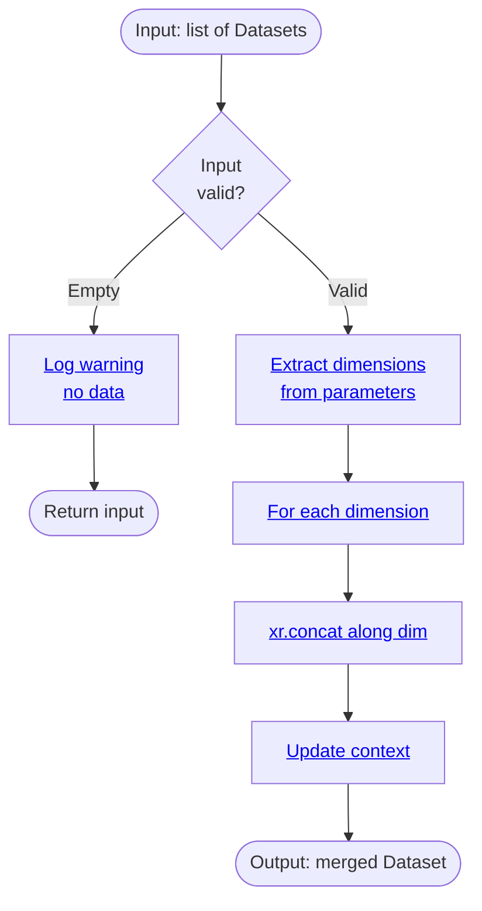

# Processor: Concatenate

**Priority:** 220 | **Category:** Data Assembly

Merge multiple climate datasets by concatenating along specified dimensions. Combine data from different models, scenarios, or time periods into unified arrays.

## Algorithm



## Parameters

| Parameter | Type | Required | Default | Description |
|-----------|------|----------|---------|-------------|
| `dim` | str or list | ✓ | — | Dimension(s) to concatenate along |

## Examples

```python
from climakitae.new_core.user_interface import ClimateData

# Combine multiple models along 'sim' dimension
data1 = ClimateData().catalog("cadcat").activity_id("WRF")...get()
data2 = ClimateData().catalog("cadcat").activity_id("LOCA2")...get()

# Merge via concatenate processor
merged = (ClimateData()
    .catalog("cadcat")
    .activity_id("WRF")
    .variable("t2max")
    .table_id("day")
    .grid_label("d03")
    .processes({
        "concatenate": {"dim": "sim"}
    })
    .get())
```

## See Also

- [Processor Index](index.md)
- [How-To Guides → Multi-Model Analysis](../howto.md#multi-model-ensemble)
