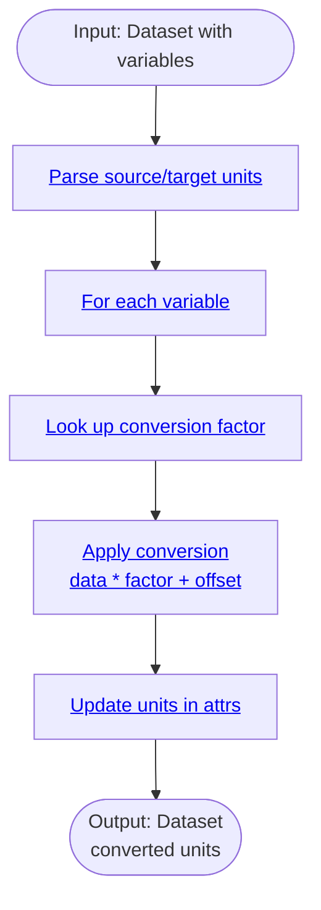

# Processor: ConvertUnits

**Priority:** 210 | **Category:** Data Conversion

Convert climate variables to different units. Transform temperature (K ↔ °C ↔ °F), precipitation (mm ↔ inches), wind speed (m/s ↔ knots), and other meteorological quantities.

## Algorithm



## Parameters

| Parameter | Type | Description |
|-----------|------|-------------|
| `source_unit` | str | Source unit (K, C, F, mm, in, m/s) |
| `target_unit` | str | Target unit (same options) |
| `variables` | list | Variables to convert (optional; default: all) |

## Supported Conversions

| Variable | Units |
|----------|-------|
| Temperature | K, °C, °F |
| Precipitation | mm/day, in/day |
| Wind Speed | m/s, knots |
| Pressure | Pa, hPa, mb |

## Examples

```python
from climakitae.new_core.user_interface import ClimateData

# Convert temperature K → °C
data = (ClimateData()
    .catalog("cadcat")
    .activity_id("WRF")
    .variable("t2max")
    .table_id("day")
    .grid_label("d03")
    .processes({
        "convert_units": {
            "source_unit": "K",
            "target_unit": "C"
        }
    })
    .get())
```

## See Also

- [Processor Index](index.md)
- [util/unit_conversions.py](https://github.com/cal-adapt/climakitae/blob/main/climakitae/util/unit_conversions.py)
