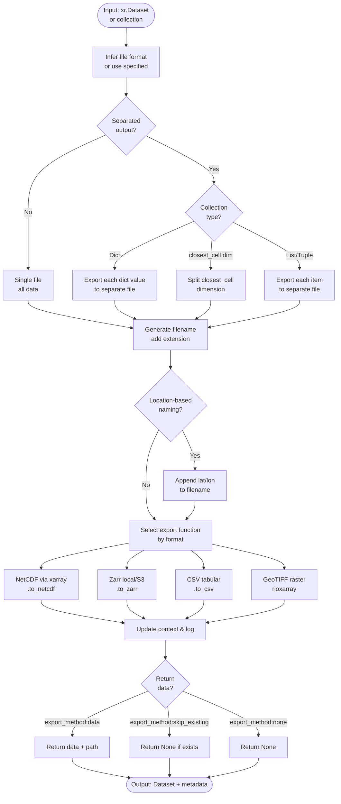

# Processor: Export

**Priority:** 9999 | **Category:** I/O & Archival

Write climate data to disk in multiple formats (NetCDF, Zarr, CSV, GeoTIFF). Handle gridded datasets, multi-point extractions, and collections with optional location-based filenames and cloud storage support.

## Algorithm



### Execution Flow

1. **Infer Format** (lines 85–95): Use `file_format` param or auto-detect from extension
2. **Check Separation** (lines 110–160): Handle dict, Dataset, or list inputs
3. **Generate Filename** (lines 170–190): Add extension and optional location coordinates
4. **Select Export Function** (lines 200–240): Route to format-specific writer
5. **Write File** (lines 212–240): Execute xarray/.to_zarr/CSV/GeoTIFF export
6. **Update Context** (lines 250–255): Record export path and metadata
7. **Return** (optional): Data + path if `export_method="data"`, None if `"none"`

## Parameters

| Parameter | Type | Required | Default | Description | Constraints |
|-----------|------|----------|---------|-------------|-------------|
| `filename` | str | | "dataexport" | Base filename (no extension) | — |
| `file_format` | str | | "NetCDF" | Output format | "NetCDF", "Zarr", "CSV", "GeoTIFF" |
| `separated` | bool | | False | Export collections to separate files | — |
| `location_based_naming` | bool | | False | Append lat/lon to filename | Only with separated=True |
| `export_method` | str | | "data" | Return behavior | "data", "skip_existing", "none" |
| `mode` | str | | "local" | Storage destination | "local", "s3" (Zarr only) |

## Code References

| Method | Lines | Purpose |
|--------|-------|---------|
| `__init__` | [70–105](https://github.com/cal-adapt/climakitae/blob/main/climakitae/new_core/processors/export.py#L70) | Parse and validate export parameters |
| `execute` | [110–160](https://github.com/cal-adapt/climakitae/blob/main/climakitae/new_core/processors/export.py#L110) | Route input type and call export |
| `_export_dataset` | [170–240](https://github.com/cal-adapt/climakitae/blob/main/climakitae/new_core/processors/export.py#L170) | Format-agnostic export logic |
| `update_context` | [250–260](https://github.com/cal-adapt/climakitae/blob/main/climakitae/new_core/processors/export.py#L250) | Record export path and metadata |

## Format Comparison

| Format | Best For | Compression | Size | Speed | Cloud Ready |
|--------|----------|-------------|------|-------|-------------|
| NetCDF | Long-term archival, standard climate data | High | Medium | Fast | Limited |
| Zarr | Cloud access, large datasets, multi-file | Medium | Large | Fast | ✓ Yes (S3) |
| CSV | Tabular analysis, spreadsheet software | Low | Large | Slow | Limited |
| GeoTIFF | Raster maps, GIS software, single slice | Medium | Medium | Fast | ✓ Yes (S3) |

## Examples

### Basic NetCDF Export

```python
from climakitae.new_core.user_interface import ClimateData

data = (ClimateData()
    .catalog("cadcat")
    .activity_id("WRF")
    .variable("t2max")
    .table_id("day")
    .grid_label("d03")
    .processes({
        "time_slice": ("2015-01-01", "2015-12-31"),
        "clip": "Alameda",
        "export": {
            "filename": "alameda_2015_temps",
            "file_format": "NetCDF"
        }
    })
    .get())

# Writes: alameda_2015_temps.nc
```

### Zarr Cloud Export

```python
# Cloud-optimized format for distributed access
data = (ClimateData()
    .catalog("cadcat")
    .activity_id("WRF")
    .variable("pr")
    .table_id("mon")
    .grid_label("d02")
    .processes({
        "export": {
            "filename": "ca_precip_20yr",
            "file_format": "Zarr",
            "mode": "s3"  # Write to S3
        }
    })
    .get())

# Writes: s3://bucket/ca_precip_20yr.zarr/
```

### Separated Multi-Point Export

```python
# Export each city to separate file
locations = [
    (34.05, -118.25),    # LA
    (37.77, -122.42),    # SF
    (32.72, -117.16)     # SD
]

data = (ClimateData()
    .catalog("cadcat")
    .activity_id("WRF")
    .variable("t2max")
    .table_id("day")
    .grid_label("d03")
    .processes({
        "clip": {
            "boundaries": locations,
            "separated": True
        },
        "export": {
            "filename": "cities_temperatures",
            "file_format": "NetCDF",
            "separated": True,
            "location_based_naming": True
        }
    })
    .get())

# Writes:
# - cities_temperatures_34-05N_118-25W.nc  (LA)
# - cities_temperatures_37-77N_122-42W.nc  (SF)
# - cities_temperatures_32-72N_117-16W.nc  (SD)
```

### CSV for Spreadsheet Analysis

```python
# Export time series for Excel/Sheets
data = (ClimateData()
    .catalog("cadcat")
    .activity_id("WRF")
    .variable("t2max")
    .table_id("day")
    .grid_label("d03")
    .processes({
        "time_slice": ("2015-01-01", "2015-12-31"),
        "clip": (37.77, -122.42),  # Single point
        "export": {
            "filename": "sf_daily_max_temp",
            "file_format": "CSV"
        }
    })
    .get())

# Writes: sf_daily_max_temp.csv
# Columns: time, t2max (one row per day)
```

### GeoTIFF for GIS

```python
# Single raster layer for ArcGIS/QGIS
data = (ClimateData()
    .catalog("cadcat")
    .activity_id("WRF")
    .variable("pr")
    .table_id("mon")
    .grid_label("d02")
    .processes({
        "time_slice": ("2015-06-01", "2015-08-31"),  # Summer
        "export": {
            "filename": "ca_summer_precip_2015",
            "file_format": "GeoTIFF"
        }
    })
    .get())

# Writes: ca_summer_precip_2015.tif
# GIS-compatible with lat/lon metadata
```

## Implementation Details

### Format-Specific Behavior

**NetCDF**: Uses xarray `.to_netcdf()` with CF conventions and compression

```python
data.to_netcdf(filename, engine="netcdf4", encoding={var: {"zlib": True} for var in data.data_vars})
```

**Zarr**: Chunked cloud-optimized format (local or S3)

```python
if mode == "s3":
    data.to_zarr(f"s3://bucket/{filename}.zarr")
else:
    data.to_zarr(f"./{filename}.zarr")
```

**CSV**: Flattens spatial dims; requires scalar or point data

```python
data.to_csv(filename)  # Works for time series at single points
```

**GeoTIFF**: Single time step, spatial (lat, lon) only

```python
data.isel(time=0).rio.to_raster(filename)  # Exports first time slice
```

### Skip Existing

With `export_method="skip_existing"`, processor checks if file exists before writing:

```python
if os.path.exists(filename):
    return None  # Don't overwrite
else:
    export_and_return_path(data, filename)
```

### Location-Based Naming

Coordinates are formatted as compass directions:

```python
# (37.7749, -122.4194) → "37-77N_122-42W"
lat_str = f"{abs(lat):.2f}{'NS'[lat < 0]}"
lon_str = f"{abs(lon):.2f}{'EW'[lon < 0]}"
filename = f"{base}_{lat_str}_{lon_str}.{ext}"
```

## Common Patterns

### Multi-Format Export

```python
data = (ClimateData()
    .catalog("cadcat")
    .activity_id("WRF")
    .variable("t2max")
    .table_id("day")
    .grid_label("d03")
    .processes({
        "time_slice": ("2015-01-01", "2015-12-31"),
        "clip": "Alameda"
    })
    .get())

# Export to multiple formats
data.to_netcdf("alameda_2015.nc")
data.to_zarr("alameda_2015.zarr")
data.to_csv("alameda_2015.csv")
```

### Batch Export Loop

```python
counties = ["Alameda", "Contra Costa", "Santa Clara"]
for county in counties:
    (ClimateData()
        .catalog("cadcat")
        .activity_id("WRF")
        .variable("t2max")
        .table_id("day")
        .grid_label("d03")
        .processes({
            "clip": county,
            "export": {
                "filename": f"{county.lower()}_2015",
                "file_format": "NetCDF"
            }
        })
        .get())
```

## See Also

- [Processor Index](index.md)
- [How-To Guides → Export Data](../howto.md#export-data)
- [Architecture → Data Export](../architecture.md#data-export-pipeline)
- xarray export docs: [.to_netcdf()](https://docs.xarray.dev/en/stable/generated/xarray.Dataset.to_netcdf.html)
