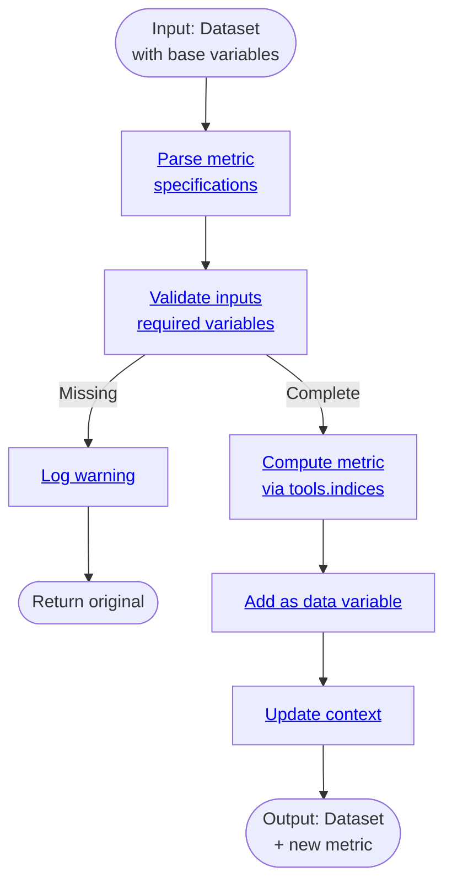

# Processor: MetricCalc

**Priority:** 230 | **Category:** Analysis & Derived Variables

Compute derived climate metrics and indices from base variables. Calculate heating/cooling degree days, heat indices, extreme event frequencies, and other climate-relevant quantities.

## Algorithm



## Supported Metrics

| Metric | Variables Required | Output |
|--------|-------------------|--------|
| HDD/CDD | tasmax, tasmin | days/season |
| Heat Index | tasmax, humidity | °C or °F |
| Extreme Days | tasmax | days/year |
| Drought Index | pr | months |

## Parameters

| Parameter | Type | Description |
|-----------|------|-------------|
| `metric` | str | Metric name (hdd, cdd, heat_index, etc.) |
| `thresholds` | dict | Metric-specific thresholds |

## Examples

```python
from climakitae.new_core.user_interface import ClimateData

# Compute heating/cooling degree days
data = (ClimateData()
    .catalog("cadcat")
    .activity_id("WRF")
    .variable("t2max")
    .table_id("day")
    .grid_label("d03")
    .processes({
        "metric_calc": {
            "metric": "hdd_cdd",
            "thresholds": {"hdd": 65, "cdd": 65}
        }
    })
    .get())
```

## See Also

- [Processor Index](index.md)
- [climakitae.tools.indices](https://github.com/cal-adapt/climakitae/blob/main/climakitae/tools/indices.py)
- [How-To Guides → Derived Variables](../howto.md#derived-variables)
