# Processor: WarmingLevel

**Priority:** 160 | **Category:** Temporal Processing

Subset climate data by global warming level thresholds instead of calendar dates. Transform time-series data to a warming-level-centric approach for climate impact analysis aligned with IPCC warming scenarios.

## Algorithm

```mermaid
flowchart TD
    Start([Input: xr.Dataset<br/>with time dimension]) --> LoadGWL["<a href='https://github.com/cal-adapt/climakitae/blob/main/climakitae/new_core/processors/warming_level.py#L91'>Load GWL lookup tables<br/>from S3 CSV</a>"]
    
    LoadGWL --> GetModels["<a href='https://github.com/cal-adapt/climakitae/blob/main/climakitae/new_core/processors/warming_level.py#L105'>Extract model/scenario<br/>from data attributes</a>"]
    
    GetModels --> LoopGWL["<a href='https://github.com/cal-adapt/climakitae/blob/main/climakitae/new_core/processors/warming_level.py#L120'>For each warming level</a>"]
    
    LoopGWL --> LookupWindow["<a href='https://github.com/cal-adapt/climakitae/blob/main/climakitae/new_core/processors/warming_level.py#L125'>Look up central year<br/>from model-scenario pair</a>"]
    
    LookupWindow --> ComputeWindow["<a href='https://github.com/cal-adapt/climakitae/blob/main/climakitae/new_core/processors/warming_level.py#L130'>Compute time window<br/>±warming_level_window years</a>"]
    
    ComputeWindow --> CheckWindow{Window<br/>valid?}
    
    CheckWindow -->|No| LogWarn["<a href='https://github.com/cal-adapt/climakitae/blob/main/climakitae/new_core/processors/warming_level.py#L145'>Log warning<br/>model doesn't reach GWL</a>"]
    CheckWindow -->|Yes| SliceTime["<a href='https://github.com/cal-adapt/climakitae/blob/main/climakitae/new_core/processors/warming_level.py#L150'>Slice to window years</a>"]
    
    LogWarn --> FilterMonth{Months<br/>filtered?}
    SliceTime --> FilterMonth
    
    FilterMonth -->|Yes| FilterSeasons["<a href='https://github.com/cal-adapt/climakitae/blob/main/climakitae/new_core/processors/warming_level.py#L155'>Keep only specified months</a>"]
    FilterMonth -->|No| CreateCoord["<a href='https://github.com/cal-adapt/climakitae/blob/main/climakitae/new_core/processors/warming_level.py#L160'>Create warming_level coordinate</a>"]
    
    FilterSeasons --> CreateCoord
    
    CreateCoord --> Concat["<a href='https://github.com/cal-adapt/climakitae/blob/main/climakitae/new_core/processors/warming_level.py#L170'>Concatenate GWL slices<br/>on warming_level dim</a>"]
    
    Concat --> UpdateCtx["<a href='https://github.com/cal-adapt/climakitae/blob/main/climakitae/new_core/processors/warming_level.py#L180'>Update context metadata</a>"]
    
    UpdateCtx --> DummyTime{Add dummy<br/>time?}
    
    DummyTime -->|Yes| AddTime["<a href='https://github.com/cal-adapt/climakitae/blob/main/climakitae/new_core/processors/warming_level.py#L185'>Replace offset dim<br/>with dummy time index</a>"]
    DummyTime -->|No| End([Output: Dataset with<br/>warming_level coordinate])
    
    AddTime --> End
```



### Execution Flow

1. **Load Lookup Tables** (lines 91–100): Read global warming level timing from S3 CSVs (1850–1900 and 1981–2010 references)
2. **Extract Metadata** (lines 105–115): Get model and scenario from data attributes
3. **Loop Over Warming Levels** (lines 120–175): For each GWL:
   - Look up central year when model reaches that warming level
   - Compute ±window year range
   - Slice time dimension to window
4. **Filter by Month** (lines 155–160, optional): Keep only specified months if provided
5. **Create Coordinate** (lines 165–170): Add `warming_level` coordinate to sliced data
6. **Concatenate** (line 170): Merge all GWL slices along new `warming_level` dimension
7. **Update Context** (lines 180–185): Record operation and window information
8. **Optional Dummy Time** (lines 185–195): Replace offset-from-center dimension with dummy time index if needed

## Parameters

| Parameter | Type | Required | Default | Description | Constraints |
|-----------|------|----------|---------|-------------|-------------|
| `warming_levels` | list[float] | ✓ | — | Global warming levels (°C above pre-industrial) | [0.8, 1.5, 2.0, 2.5, 3.0] common; 1.5–4.0 typical |
| `warming_level_window` | int | | 15 | Years before/after central year to include | ≥1; 15 year window typical (30 year total) |
| `warming_level_months` | list[int] | | UNSET | Months to keep (1–12) | E.g., [6,7,8] for JJA; UNSET = all months |
| `add_dummy_time` | bool | | False | Replace offset-from-center dimension with dummy time | Useful for tools requiring time dimension |

## Code References

| Method | Lines | Purpose |
|--------|-------|---------|
| `__init__` | [70–95](https://github.com/cal-adapt/climakitae/blob/main/climakitae/new_core/processors/warming_level.py#L70) | Parse and validate warming level parameters |
| `execute` | [105–195](https://github.com/cal-adapt/climakitae/blob/main/climakitae/new_core/processors/warming_level.py#L105) | Route input and apply GWL transformation |
| `_transform_gwl` | [200–230](https://github.com/cal-adapt/climakitae/blob/main/climakitae/new_core/processors/warming_level.py#L200) | Core GWL lookup and slicing logic |
| `update_context` | [235–250](https://github.com/cal-adapt/climakitae/blob/main/climakitae/new_core/processors/warming_level.py#L235) | Record GWL window and metadata |

## Examples

### Single Warming Level

```python
from climakitae.new_core.user_interface import ClimateData

# Extract data at 1.5°C warming
data = (ClimateData()
    .catalog("cadcat")
    .activity_id("WRF")
    .experiment_id("ssp245")
    .variable("t2max")
    .table_id("day")
    .grid_label("d03")
    .processes({
        "warming_level": {
            "warming_levels": [1.5]
        }
    })
    .get())
```

### Multiple Warming Levels

```python
# Compare 1.5°C, 2.0°C, and 3.0°C warming levels
data = (ClimateData()
    .catalog("cadcat")
    .activity_id("LOCA2")
    .experiment_id("ssp370")
    .variable("tasmax")
    .table_id("day")
    .grid_label("d02")
    .processes({
        "warming_level": {
            "warming_levels": [1.5, 2.0, 3.0]
        }
    })
    .get())

# data.warming_level is now a coordinate with 3 values
# Access with: data.sel(warming_level=1.5)
```

### Custom Window

```python
# Use 20-year windows (instead of default 15)
data = (ClimateData()
    .catalog("cadcat")
    .activity_id("WRF")
    .experiment_id("ssp585")
    .variable("pr")
    .table_id("mon")
    .grid_label("d03")
    .processes({
        "warming_level": {
            "warming_levels": [2.0, 2.5],
            "warming_level_window": 20
        }
    })
    .get())
```

### Seasonal Filter

```python
# Summer (JJA) only at 2°C warming
data = (ClimateData()
    .catalog("cadcat")
    .activity_id("WRF")
    .experiment_id("ssp245")
    .variable("t2max")
    .table_id("day")
    .grid_label("d03")
    .processes({
        "warming_level": {
            "warming_levels": [2.0],
            "warming_level_months": [6, 7, 8]  # June, July, August
        }
    })
    .get())
```

### Chained with Clipping

```python
# Full workflow: clip + warming level + export
data = (ClimateData()
    .catalog("cadcat")
    .activity_id("WRF")
    .experiment_id("ssp245")
    .variable("t2max")
    .table_id("day")
    .grid_label("d03")
    .processes({
        "clip": "San Francisco Bay",
        "warming_level": {
            "warming_levels": [1.5, 2.0, 3.0],
            "warming_level_window": 15
        },
        "export": {
            "filename": "sf_warming_levels",
            "file_format": "NetCDF"
        }
    })
    .get())
```

## Implementation Details

### Global Warming Level Lookup

GWL timing is pre-computed from climate model simulations and stored in S3 CSV files:

- **`gwl_1850-1900ref.csv`**: Years when each model reaches warming levels (1850–1900 baseline)
- **`gwl_1981-2010ref.csv`**: Alternative reference period (1981–2010)

Lookup keys are `(model, scenario, reference_period)`. If not found, processor returns None or logs warning.

### Time Windows

The processor creates a time window around the central year:

```python
central_year = lookup_table.loc[(model, scenario, gwl)]
window_start = central_year - warming_level_window
window_end = central_year + warming_level_window
time_slice = data.sel(time=slice(f"{window_start}", f"{window_end}"))
```

With default `warming_level_window=15`, this creates a 30-year window (±15 years).

### Edge Cases

- **Model doesn't reach GWL**: Processor logs warning, returns NaN for that level
- **Incomplete coverage**: If some models reach GWL and others don't, multi-model ensemble may have uneven data
- **Monthly filtering**: Applied after time slicing, so month counts may vary

### Dummy Time (Optional)

Some tools require a time dimension. Setting `add_dummy_time=True` replaces the `months_from_center` or `days_from_center` coordinate with:

```python
dummy_time = np.arange(len(data.time))  # [0, 1, 2, ...]
```

This is useful for downstream analysis but loses temporal semantics.

## Common Patterns

### Compare Scenarios at Same Warming Level

```python
# Historical, SSP2-4.5, SSP5-8.5 at 2°C warming
scenarios = ["historical", "ssp245", "ssp585"]
results = {}

for scenario in scenarios:
    results[scenario] = (ClimateData()
        .catalog("cadcat")
        .activity_id("WRF")
        .experiment_id(scenario)
        .variable("t2max")
        .table_id("day")
        .grid_label("d03")
        .processes({
            "warming_level": {"warming_levels": [2.0]}
        })
        .get())
```

### Model Uncertainty Across Warming Levels

```python
# Get all 5 WRF models at multiple warming levels
data = (ClimateData()
    .catalog("cadcat")
    .activity_id("WRF")
    .experiment_id("ssp370")
    .variable("pr")
    .table_id("mon")
    .grid_label("d03")
    .processes({
        "warming_level": {
            "warming_levels": [1.5, 2.0, 2.5, 3.0]
        }
    })
    .get())

# data.dims: (warming_level, sim, lat, lon)
# Compute multi-model mean across warming levels
multi_model_mean = data.mean(dim="sim")
```

## See Also

- [Processor Index](index.md)
- [Time Slice Processor](time_slice.md) — Alternative: calendar-based temporal subsetting
- [Architecture → Warming Levels Concept](../concepts.md#global-warming-levels)
- [How-To Guides → Warming Level Analysis](../howto.md#warming-level-analysis)
- Cal-Adapt GWL Resources: [IPCC AR6 Warming Levels](https://www.ipcc.ch/)
